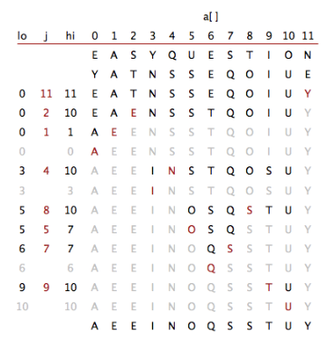

# Exercise 10

 2.3.2 

Show in the style of the quicksort trace in SW 2.3, how quicksort sorts the array $\texttt{E A S Y Q U E S T I O N}$.

- After shuffle, partitions with Y. Only one subarray 0-10.
- Partitions subarray with E, then sorts subarray 0-1.
- Partitions subarray 3-10 with N. Subarray 3 with the I is 1-length and sorted.
- Partitions subarray 5-10 with S.
- Sorts subarray 5-7.
- Sorts subarray 9-10

 2.3.3 

During a quicksort execution, the largest item can be exchanged at most $\lg N$ times for an array of length $N$.

 2.3.8 

For an array of $N$ equal items, quicksort will make $N\lg N$ compares. Each partition divides the array in half $\pm1$.

 5.1.2 

Trace of LSD string sort for keys: $\texttt{no is th ti fo al go pe to co to th ai of th pa}$

Alphabet of example:

| 0   | 1   | 2   | 3   | 4   | 5   | 6   | 7   | 8   | 9   | 10  | 11  | 12  |
| --- | --- | --- | --- | --- | --- | --- | --- | --- | --- | --- | --- | --- |
| a   | c   | e   | f   | g   | h   | i   | l   | n   | o   | p   | s   | t   |

Sort of last digit:

| a   | c   | e   | f   | g   | h   | i   | l   | n   | o   | p   | s   | t   | -   |
| --- | --- | --- | --- | --- | --- | --- | --- | --- | --- | --- | --- | --- | --- |
| 0   | 1   | 0   | 1   | 1   | 0   | 3   | 2   | 1   | 0   | 6   | 0   | 1   | 0   |
 
Infix sum:

| a   | c   | e   | f   | g   | h   | i   | l   | n   | o   | p   | s   | t   | -   |
| --- | --- | --- | --- | --- | --- | --- | --- | --- | --- | --- | --- | --- | --- |
| 0   | 1   | 1   | 2   | 3   | 3   | 6   | 8   | 9   | 9   | 15  | 15  | 16  | 16  |

Aux array:

| 0   | 1   | 2   | 3   | 4   | 5   | 6   | 7   | 8   | 9   | 10  | 11  | 12  | 13  | 14  | 15  |
| --- | --- | --- | --- | --- | --- | --- | --- | --- | --- | --- | --- | --- | --- | --- | --- |
| pa  | pe  | of  | th  | th  | th  | ti  | ai  | al  | no  | fo  | go  | to  | co  | to  | is  |

Now the first letter:

| a   | c   | e   | f   | g   | h   | i   | l   | n   | o   | p   | s   | t   | -   |
| --- | --- | --- | --- | --- | --- | --- | --- | --- | --- | --- | --- | --- | --- |
| 0   | 2   | 1   | 0   | 1   | 1   | 0   | 1   | 0   | 1   | 1   | 2   | 0   | 6   |
 
Infix sum:

| a   | c   | e   | f   | g   | h   | i   | l   | n   | o   | p   | s   | t   | -   |
| --- | --- | --- | --- | --- | --- | --- | --- | --- | --- | --- | --- | --- | --- |
| 0   | 2   | 3   | 3   | 4   | 5   | 5   | 6   | 6   | 7   | 8   | 10  | 10  | 16  |

Final sorted array:

| 0   | 1   | 2   | 3   | 4   | 5   | 6   | 7   | 8   | 9   | 10  | 11  | 12  | 13  | 14  | 15  |
| --- | --- | --- | --- | --- | --- | --- | --- | --- | --- | --- | --- | --- | --- | --- | --- |
| ai  | al  | co  | fo  | go  | is  | no  | of  | pa  | pe  | th  | th  | th  | ti  | to  | to  |

 5.1.3 

Trace of MSD string sort for keys: $\texttt{no is th ti fo al go pe to co to th ai of th pa}$

Alphabet of example:

| 0   | 1   | 2   | 3   | 4   | 5   | 6   | 7   | 8   | 9   | 10  | 11  | 12  |
| --- | --- | --- | --- | --- | --- | --- | --- | --- | --- | --- | --- | --- |
| a   | c   | e   | f   | g   | h   | i   | l   | n   | o   | p   | s   | t   |

Starting array:

| 0   | 1   | 2   | 3   | 4   | 5   | 6   | 7   | 8   | 9   | 10  | 11  | 12  | 13  | 14  | 15  |
| --- | --- | --- | --- | --- | --- | --- | --- | --- | --- | --- | --- | --- | --- | --- | --- |
| no  | is  | th  | ti  | fo  | al  | go  | pe  | to  | co  | to  | th  | ai  | of  | th  | pa  |

Partition by first letter using key-indexed counting:

| a   | c   | e   | f   | g   | h   | i   | l   | n   | o   | p   | s   | t   | -   |
| --- | --- | --- | --- | --- | --- | --- | --- | --- | --- | --- | --- | --- | --- |
| 0   | 2   | 1   | 0   | 1   | 1   | 0   | 1   | 0   | 1   | 1   | 2   | 0   | 6   |

Infix sum:

| a   | c   | e   | f   | g   | h   | i   | l   | n   | o   | p   | s   | t   | -   |
| --- | --- | --- | --- | --- | --- | --- | --- | --- | --- | --- | --- | --- | --- |
| 0   | 2   | 3   | 3   | 4   | 5   | 5   | 6   | 6   | 7   | 8   | 10  | 10  | 16  |

Partitioned array:

| 0   | 1   | 2   | 3   | 4   | 5   | 6   | 7   | 8   | 9   | 10  | 11  | 12  | 13  | 14  | 15  |
| --- | --- | --- | --- | --- | --- | --- | --- | --- | --- | --- | --- | --- | --- | --- | --- |
| al  | ai  | co  | fo  | go  | is  | no  | of  | pe  | pa  | th  | ti  | to  | to  | th  | th  |

Do the same key-indexed counting for each subarray of the keys with the same first letter.  
Final sorted array:

| 0   | 1   | 2   | 3   | 4   | 5   | 6   | 7   | 8   | 9   | 10  | 11  | 12  | 13  | 14  | 15  |
| --- | --- | --- | --- | --- | --- | --- | --- | --- | --- | --- | --- | --- | --- | --- | --- |
| ai  | al  | co  | fo  | go  | is  | no  | of  | pa  | pe  | th  | th  | th  | ti  | to  | to  |

 2.3.5 

With $N$ extra space, create an auxiliary array. Scan through the array to be sorted, put the smallest key in the aux array
starting from left to right, and put the largest key into the aux array from right to left.

In-place: Do a partition with an element between the two distinct keys.

 2.3.4 

6 examples of 10-length arrays in different order that yield worst-case number of compares in quicksort without the inital shuffle:

Without the initial random shuffle, both ascending and descending order gives worst-case number of compares.

| 0   | 10  | 1   | 9   | 2   | 8   | 3   | 7   | 4   | 6   | 5   |
| --- | --- | --- | --- | --- | --- | --- | --- | --- | --- | --- |

| 10  | 0   | 9   | 1   | 8   | 2   | 7   | 3   | 6   | 4   | 5   |
| --- | --- | --- | --- | --- | --- | --- | --- | --- | --- | --- |

| 10  | 9   | 8   | 7   | 6   | 5   | 0   | 1   | 2   | 3   | 4   |
| --- | --- | --- | --- | --- | --- | --- | --- | --- | --- | --- |

| 0   | 1   | 2   | 3   | 4   | 5   | 10  | 9   | 8   | 7   | 6   |
| --- | --- | --- | --- | --- | --- | --- | --- | --- | --- | --- |

 2.3.13 

The worst case recursive depth of quicksort is $N-1$. If the largest or smallest key is chosen in every recursive call.

The best case recursive depth is $\lg N$ when the middle item is chosen each recursive call.

The average case is somewhere in between, but probably closest to the best case.

 5.1.17 

 Old exam set 120531: 3(d-j) 

In the following questions, consider the sequences of integers,

| 6425 | 5467 | 4857 | 5479 | 4794 | 2386 | 5678 | 9974 |
| ---- | ---- | ---- | ---- | ---- | ---- | ---- | ---- |

as input to a sorting algorithm. Each question describes an intermediate stage of one and only one sorting algorithm:
quicksort, (top-down) merge sort, insertion sort, selection sort, LSD string sort, MSD string sort, and heap sort.
Which is which?

<ol type="a" start="4">
  <li> Quicksort, after the first partition.
  <li> Array is in heap order, so heap sort.
  <li> Merge sort, before the final merge.
  <li> Selection sort, after two exchanges.
  <li> LSD after sorting by the last digit.
  <li> Insertion sort, after two exchanges.
  <li> MSD after sorting by the first digit.
</ol>

 2.3.17 

 2.3.15 
