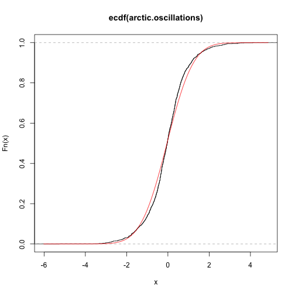
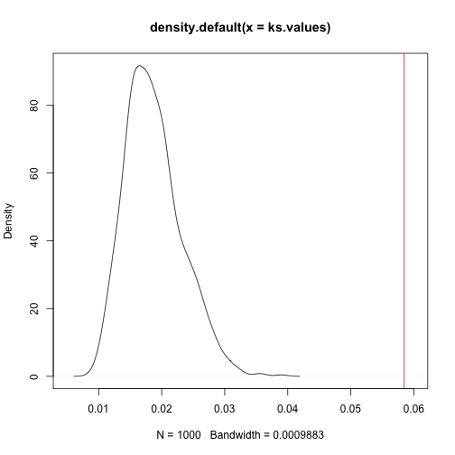

## 1. Basic bootstrapping (Theory)

We generate a single bootstrap dataset $x^*_1, \dots, x^*_n$ from the empirical distribution function of 

\[
  1, 4, 6, 7, 8, 11, 15, 19
\]

a. What is the probability that the bootstrap sample mean is equal to 19?

Each of the 8 samples are picked with equal probability $1/8$, because 
we are picking from 8 i.i.d., and they all have to be 19 for the mean to be equal to 19.

$$
P(\bar{x}^* = 19) = \left(\frac{1}{8}\right)^8 = \frac{1}{16777216}
$$

b. What is the probability that the minimum of the bootstrap dataset is 1?

Probability that the minimum is not a one; no 1 is sampled in the 8 samples

$$
\begin{align*}
P(min(x^*_1,\ldots,x^*_n) = 1) = 1 - \left(\frac{7}{8}\right)^8 = 0.656
\end{align*}
$$

```r
empdist <- c(1,4,6,7,8,11,15,19)
mins <- c()
for (i in 1:1000) {
  samples <- sample(empdist, length(empdist), replace=TRUE)
  mins <- c(mins, min(samples))
}
sum(mins == 1) / length(mins)
```

```
## [1] 0.679
```


c. What is the probability that in the bootstrap sample exactly two elements are $\le 6$ and all the other are $\ge 15$?

Y = 2 elements are $\leq 6$ and all other elements are $\geq 15$ 

$$
P(Y) = \left(\frac{3}{8}\right)^2 \left( \frac{2}{8} \right)^6 \binom{8}{2} = 0.000961
$$


```r
y <- c()
for (i in 1:10000) {
  samples <- sample(empdist, length(empdist), replace=TRUE)
  if (sum(samples <= 6) == 2 & sum(samples >= 15) == 6) {
    y <- c(y, 1)
  } else {
    y <- c(y, 0)
  }
}
sum(y) / length(y)
```

```
## [1] 8e-04
```

## 2. Unbiased estimators (Theory)

Consider a random sample $X_1, \dots, X_n$ from a uniform distribution in the interval $[-\theta, \theta]$, where $\theta$ is an unknown parameter.
You are interested in estimating the values of $\theta$.

a. Show that $\hat{\Theta} = \frac{2}{n}(|X_1| + |X_2| + \dots + |X_n|)$
is an unbiased estimator for $\theta$. 
_Hint_: you may need to use the _change of variable_ formula (cfr. Chapter 7 of the book).

\begin{align*}
  E[\hat{\Theta}] &= \frac{2}{n} (E[\lvert x_1 \rvert] + \dots + E[\lvert x_n \rvert]) \\
  &= \frac{2}{n} \sum^{n}_{i=1} E[\lvert x_i \rvert] \\
  &= \frac{2}{n} \sum^{n}_{i=1} \frac{\theta}{2} = \theta
\end{align*}

For $U(a, b)$, the distribution function is $f(x) = 1/(b-a)$, so in this case
$$f(x) = \frac{1}{2\theta}$$
Change of variable formula
$$\int_{-\infty}^{\infty} g(x)f(x) dx$$
In this case $g(x) = \lvert x \rvert$

\begin{align*}
  E[\lvert x \rvert] &= \int_{-\theta}^{\theta} \left\vert \frac{1}{2\theta} x \right\vert dx \\
  &= \int_{-\theta}^0 - \frac{1}{2\theta} x dx + \int_{0}^{\theta} \frac{1}{2\theta} x dx \\
  &= \frac{\theta}{4} + \frac{\theta}{4} = \frac{\theta}{2}
\end{align*}

b. Consider instead the problem of estimating $\theta^2$. Show that

\[
  T = \frac{3}{n}(X_1^2 + X_2^2 + \dots + X_n^2)
\]

is an unbiased estimator for $\theta^2$

\begin{align*}
  E[T] &= \frac{3}{n} (E[x_i^2] + \dots + E[x_n^2]) \\
  &= \frac{3}{n} \sum^{n}_{i=1} E[x_n^2] \\
  &= \int_{-\theta}^{\theta} \frac{1}{2\theta} x^2 dx \\
  &= \frac{2\theta^3}{6\theta} = \frac{1}{3}\theta^3 \\
  &= \frac{3}{n} \sum^{n}_{i=1} \frac{\theta^2}{3} = \theta^2
\end{align*}

c. Is $\sqrt{T}$ an unbiased estimator for $\theta$? If not, discuss whether it has positive or negative bias.

\begin{align*}
  E[\sqrt{T}] &= \theta \\
  g(x) &= \sqrt{x}
\end{align*}

Jensen's Inequality:

$$
E[g(X)] \geq g(E[X]
$$

Assumption: $g(x)$ is convex
$g(x)=\sqrt{T}$ is concave, multiply by $-1$ to make it convex

\begin{align*}
  E[-\sqrt{T}] &\geq -\sqrt{E[T]} \\
  -E[\sqrt{T}] &\geq -\sqrt{E[T]} \\
  E[\sqrt{T}] &< \sqrt{E[T]} \\
  E[\sqrt{T}] &< \theta
\end{align*}

The expected value of the estimater is lower than $\theta$, so the estimator is
negatively biased.

## 3. When the empirical bootstrapp fails (Theory)

The empirical bootstrap is a very powerful tool[^1], but there are some situations where its usage is not appropriate.

[^1]: So much that it has recently been [defined](https://www.significancemagazine.com/science/608-what-is-the-bootstrap) "the best statistical pain reliever ever produced", along with other colorful names, see the acknowledgements section of Efron's [original paper](https://projecteuclid.org/download/pdf_1/euclid.aos/1176344552)

Consider a dataset $x_1, x_2, \dots, x_n$, which is a realization of the random sample $X_1, X_2, \dots, X_n$ from a $U(0, \theta)$ distribution. Consider the following sample statistic

$$
  T_n =
  1 - \frac{M_n}{\theta}
$$

where $M_n$ is the maximum of $X_1, \dots, X_n$.
Let $m_n$ be the maximum of the dataset $x_1, x_2, \dots, x_n$, and let $X_1^*, \dots, X_n^*$ be a bootstrap random sample from the empirical distribution function of our dataset. Finally, let  $M_n^*$ be the maximum of the bootstrap sample, and consider

$$
  T^*_n =
  1 - \frac{M_n^*}{m_n}
$$

a. Compute $Pr[M^*_n < m_n]$.

$$
Pr[M^*_n < m_n] &= (1 - p(x_i^* = m_n))^n
$$

Assuming the frequency of the maximum is $1/n$:

\[Pr[M^*_n < m_n] = \left(1 - \frac{1}{n} \right)^n\]

b. Argue that $Pr[T^*_n \le 0] = Pr[M_n^* = m_n]$ and then use the result from the previous point to show that

\[
Pr[T_n^* \le 0] = 1 - \left( 1- \frac{1}{n}\right)^n
\]

Furthermore, argue that $Pr[T_n \le 0] = 0$.

$M^*_n$ cannot be larger than $m_n$, so the only case that $T^*_n \leq 0$ is when $M^*_n = m_n$, as the fraction 
$M^*_n/m_n = 1$, and as such $T^*_n = 0$. Thus $Pr[T^*_n \leq 0] = Pr[M^*_n = m_n]$

We previously computed $Pr[M^*_n < m_n]$, this is the inverse, so

\[Pr[T^*_n \leq 0] = Pr[M^*_n = m_n] = 1 - Pr[M^*_n < m_n] = 1 - \left(1 - \frac{1}{n}\right)^n\]

c. Let $F_n(t) = Pr[T_n \le t]$ be the distribution function of $T_n$, and let $F_n^*(t) = Pr[T_n^* \le t]$ be the distribution function of the bootstrap statistic $T_n^*$.
Using the result of point b, show that the Kolmogorov-Smirnov distance between the two distributions can be lower bounded as

\[
  \sup_{t\in \mathbb{R}} |F_n^*(t) - F_n(t)| \ge 
  1 - \left( 1- \frac{1}{n}\right)^n
\]

_Hint_: consider what happens for $t=0$ to find the lower bound to the Kolmogorov-Smirnov distance.

In the case of $t=0$

$$
\begin{align*}
  &\sup_{t \in \mathbb{R}} \lvert F^*_n(0) - F_n(0) \rvert \geq 1 - \left( 1 - \frac{1}{n} \right)^n \\
  &\Leftrightarrow \sup_{t \in \mathbb{R}} \lvert F^*_n(0) \rvert = Pr[]
\end{align*}
$$

$$
\begin{align*}
  \sup_{t \in \mathbb{R}} \lvert F^*_n(t) - F_n(t) &\geq \sup_{t \in \mathbb{R}} \lvert F^*_n(0) - F_n(0) \\
  &= 1 - \left( \frac{n-1}{n} \right)^n
\end{align*}
$$

d. Use the fact that $e^{-x} \ge 1 - x$ to show that

\[
  1 - \left( 1- \frac{1}{n}\right)^n \ge
  1 - e^{-1} \approx
  0.632
\]

Therefore, you have shown that the Kolmogorov-Smirnov distance between the two distributions is always larger than 0.632, independently of the number of samples $n$.
Discuss, during the exercise session, the consequences of this fact for the bootstrap statistic $T_n^*$.


## 4. Is this die fair? (R)

Imagine a situation of purchasing an antique die from the internet for gambling. Before purchasing,
you want to make sure that the die is fair.
The seller provides 1000 samples of the outcomes available in the file `die_samples.Rdata` (you can access them by the command `load("die_samples.Rdata")`, provided that the file is in the same directory as you RMarkdown file).
After loading the file, you can access the dataset under the name `die_samples`.
Use bootstrap to determine whether the die is fair or not. 
Hint: investigate the indicator random variables $I_k=h_k(X), k=1,2,...,6$, where $I_k=1 \text{ if } X=k$, and $I_k=0$, otherwise. What would be their expectation if the die was fair? Can you observe a systematic deviation?

You would expect that all $I_k=1000/6$ if the die was fair.

```r
load("die_samples.Rdata")
bootstrap.I <- function (n) {
  samples <- sample(die_samples, 1000, replace=TRUE)
  I <- rep(0, 6)
  for (i in 1:6) {
    I[i] <- sum(samples == i)
  }
  return (I)
}
sapply(matrix(1:1000), bootstrap.I) %>%
  apply(1, mean) %>% matrix -> I.bootstrapped
rownames(I.bootstrapped) <- paste(rep("I", 6), 1:6, sep="")
kbl(I.bootstrapped, booktabs = T, format = 'latex', linesep = '') %>%
  kable_styling(latex_options = c('striped', 'hold_position'))
```

<table class=" lightable-material-dark lightable-striped lightable-hover" style='font-family: "Source Sans Pro", helvetica, sans-serif; margin-left: auto; margin-right: auto;'>
<tbody>
  <tr>
   <td style="text-align:left;"> I1 </td>
   <td style="text-align:right;"> 152.452 </td>
  </tr>
  <tr>
   <td style="text-align:left;"> I2 </td>
   <td style="text-align:right;"> 159.009 </td>
  </tr>
  <tr>
   <td style="text-align:left;"> I3 </td>
   <td style="text-align:right;"> 174.031 </td>
  </tr>
  <tr>
   <td style="text-align:left;"> I4 </td>
   <td style="text-align:right;"> 163.916 </td>
  </tr>
  <tr>
   <td style="text-align:left;"> I5 </td>
   <td style="text-align:right;"> 161.412 </td>
  </tr>
  <tr>
   <td style="text-align:left;"> I6 </td>
   <td style="text-align:right;"> 189.180 </td>
  </tr>
</tbody>
</table>

Clearly, the values are not all equal and as such the die is not fair. In particular, it seems to roll 3 and 6 more often than any other value, and rolls 1 a fair bit less than any other value.

## 5. Bright stars (R)

Consider the `brightness` dataset from the `UsingR` package, which collects the brightness of 966 stars.
Using empirical bootstrap, estimate the probability

\[
Pr[|\bar{X}_n - \mu| > 0.1]
\]

where $\mu$ is the _true_ mean of the distribution. 
_Hint_: as we did in class, you will need to approximate this probability by replacing the sample mean with the bootstrapped mean, and $\mu$ with the sample mean.

```r
sample.means <- sapply(matrix(1:1000), \(n) mean(sample(brightness, 966, replace = TRUE)))
deviation.from.mean <- sample.means - mean(brightness)
sum(abs(deviation.from.mean) > 0.1) / 1000
```

```
## [1] 0.012
```

## 6. Parametric bootstrap (R)

The dataset `arctic.oscillations` (in package UsingR) contains a time series from January to June 2002 of sea-level pressure measurement at the arctic, relative to some base line. 
Use parametric bootstrap to judge whether it is safe to assume that the measurements are samples from normal distribution or not. 
_Hint_: use parametric bootstrap in combination with the Kolmogorov-Smirnov distance, as we did in class.


```r
arctic.oscillations <- na.omit(arctic.oscillations)
plot(ecdf(arctic.oscillations))
mu.est <- mean(arctic.oscillations)
var.est <- var(arctic.oscillations)
curve(pnorm(x, mu.est, var.est), col = 'red', add = T)
```



```r
ks.dist.norm <- function (bootstrapped.data, mu, variance) {
  emp.dist <- ecdf(bootstrapped.data)
  max(abs(emp.dist(bootstrapped.data) - pnorm(bootstrapped.data, mu, variance)))
}

ks.est <- ks.dist.norm(arctic.oscillations, mu.est, var.est)

bootstrap.ks <- function (mu, variance) {
  bootstrap.sample <- rnorm(length(arctic.oscillations), mu, variance)
  bootstrap.mean <- mean(bootstrap.sample)
  bootstrap.var <- var(bootstrap.sample)
  ks.dist.norm(bootstrap.sample, bootstrap.mean, bootstrap.var)
}
ks.values <- sapply(1:1000, \(n) bootstrap.ks(mu.est, var.est))
plot(density(ks.values), xlim = c(0.005, 0.06))
abline(v=ks.est, col='red')
```



Seems like a normal distribution with the estimated parameters is not a good fit.
