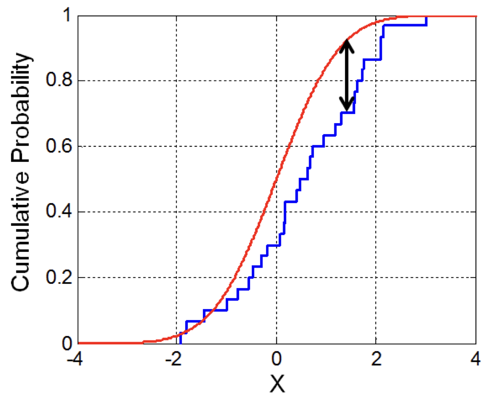
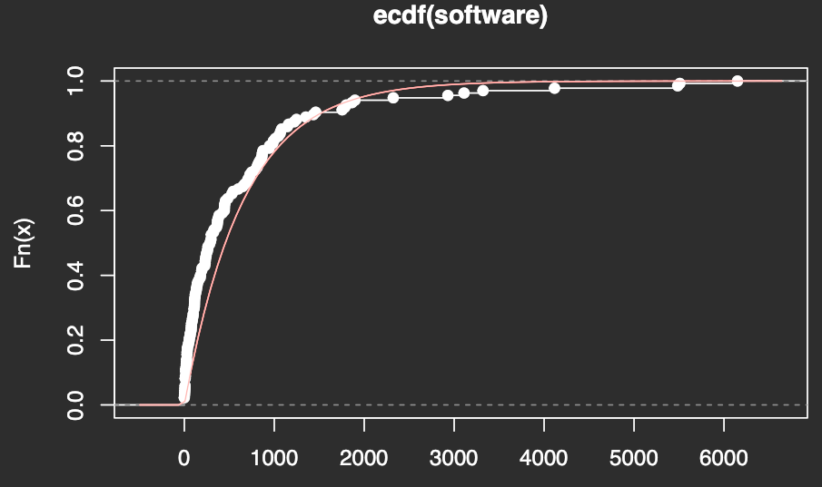
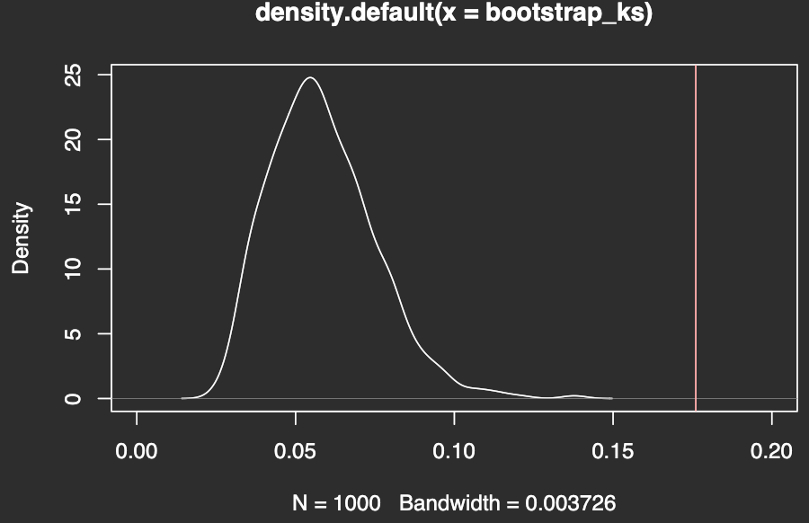

# Bootstrapping

[Bootstrapping Statistics. What it is and why it’s used | Towards Data Science](https://towardsdatascience.com/bootstrapping-statistics-what-it-is-and-why-its-used-e2fa29577307)

## The bootstrap principle

- Sample a random sample  $X_1, \ldots, X_n$ from a distribution $F$
- The dataset $x_1, \ldots, x_n$ is a realization of the random sample
- Use the dataset $x_1, \ldots, x_n$ to define a distribution $\hat{F}$
- $x_1^*, \ldots, x_n^*$ is a realization of the random sample $X_1^*, \ldots, X_n^*$ from $\hat{F}$

In plain english:

- Sample $n$ random samples from a distribution
- From those sample, sample uniformly $n$ times with replacement
- The resulting sample is a bootstrap sample

## Empirical bootstrap

- You have no knowledge of the distribution from which the random sample is from
- We know that the ECDF is a good approximation for the *true* distribution function
- Use the ECDF to define $\hat{F}$
- In practice, this means sampling sampling uniformly at random, *with replacement*, from the dataset

Empirical bootstrap for the mean:

- Consider the distribution of $\overline{X} - \mu$
- Compute $\overline{x}$, the sample mean of $x_1, \ldots, x_n$
  1. Sample with replacement $x_1^*, \ldots, x_n^*$ from $x_1, \ldots, x_n$ uniformly at random
  2. Compute the centered sample mean $\overline{x^*} - \overline{x}$
  
  Repeat these two steps many times
- By the bootstrap principle, the distribution of $\overline{X^*} - \overline{X}$
  resembles the one of $\overline{X} - \mu$
  
## Parametric bootstrapping

- We are using a statistical model, i.e. a distribution with parameters
- We can use the estimates $\theta$ of the parameters to get an estimated distribution $F_{\hat{\theta}}$ 
- Sample $x_1^*, \ldots, x_n^*$ from $F_{\hat{\theta}}$ 

#### Does our model fit the data?

- Calculate the Kolmogorov-Smirnov distance
- $\displaystyle t_{ks} = \sup_{a \in \R} | F_n(a) - F_{\hat{\theta}} |$
- $t_{ks}$ itself is a random variable
- How likely is it to see $t_{ks}$ if the random sample were truly distributed as we hypothesize?

<figure>
<p align="center">
  
</p>
<figcaption align="center">Kolmogorov-Smirnov distance</figcaption>
</figure>

!!! example KS distance in R
    #### KS distance on the software dataset
    
    ```R
    software<- c(0,0,0,2,4,6,8,9,10,10,10,12,15,15,16,21,22,24,26,30,30,31,33,36,44,50,55,58,65,68,
                 75,77,79,81,88,91,97,100,108,108,
                 112,113,114,115,120,122,129,134,138,143,
                 148,160,176,180,193,193,197,227,232,233,
                 236,242,245,255,261,263,281,290,296,300,
                 300,325,330,357,365,369,371,379,386,422,
                 445,446,447,452,457,482,529,529,543,600,
                 648,670,700,707,724,729,748,790,810,816,
                 828,843,860,865,868,875,943,948,983,990,
                 1011,1045,1064,1071,1082,1146,1160,1222,1247,1351,
                 1435,1461,1755,1783,1800,1864,1897,2323,2930,3110,
                 3321,4116,5485,5509,6150)
    plot(ecdf(software))
    lambda_estimate = 1/mean(software)
    curve(pexp(x, rate=lambda_estimate), col='red', add=T)
    ```
    
    
    Is the exponential distribution with the estimated parameter really a good fit?
    
    ```R
    ks_distance_exp_distribution <- function(bootstrapped_data, lambda) {
      empirical_distribution <- ecdf(bootstrapped_data)
      max(abs(empirical_distribution(bootstrapped_data) - pexp(bootstrapped_data, rate = lambda)))
    }
    ks_estimate <- ks_distance_exp_distribution(software, lambda_estimate)

    bootstrap_ks <- c()
    for (i in 1:1000) {
      bootstrap_sample <- rexp(length(software), lambda_estimate)
      bootstrap_lambda <- 1/mean(bootstrap_sample)
      bootstrap_ks <- c(bootstrap_ks, ks_distance_exp_distribution(bootstrap_sample, bootstrap_lambda))
    }

    plot(density(bootstrap_ks), xlim=c(0,0.2))
    abline(v=ks_estimate, col='red')
    ```
    
    Looks like it's not!
