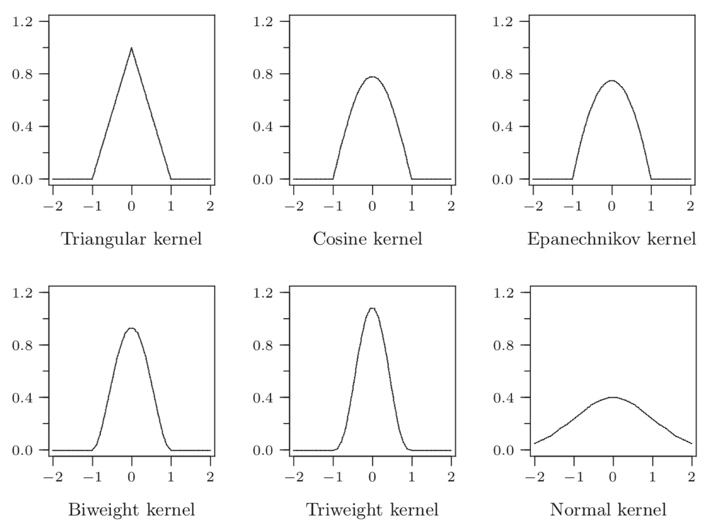
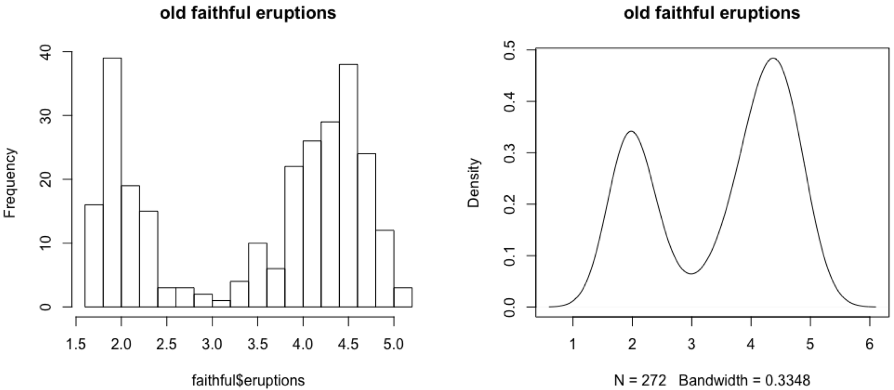
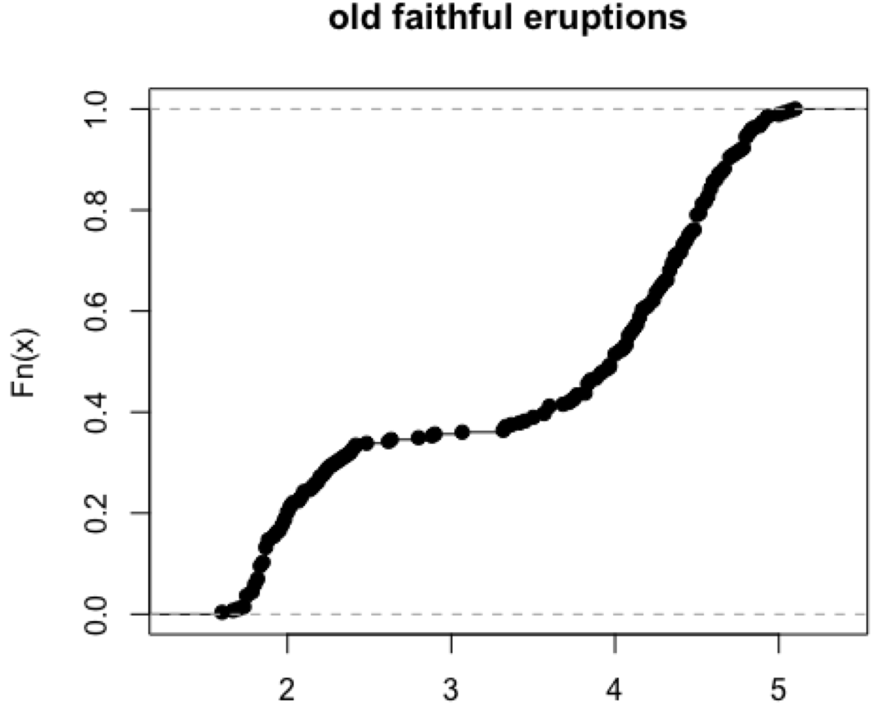

# Exploratory Data Analysis

## Histograms

A histogram has properties:

- Data $x_1, \ldots, x_n$ with $x_i \in \R$
- Define bins $B_1, \dots, B_m$
  - $B_i = \left[l_i, r_i \right) \subseteq \R$
  - $\lvert{B_i}\rvert$ denotes the length of the interval
- The height of each bin is such that the total area of the histogram is 1

$$
\def\abs#1{\lvert #1 \rvert}
\text{height }B_i = \frac{\text{number of } x_j \text{in } B_i}{n\abs{B_i}}
$$
Good bin width for normally distributed data: $b = \displaystyle\frac{24\sqrt{n}^\frac{1}{3}s}{\sqrt[3]{n}}$

## Kernel Density Estimate

Associate a *kernel* to each data point on the $x$ axis.\
A *kernel* is:

- A function $K: \R \to \R$
- $\displaystyle\int^{\infty}_{-\infty}K(x)dx = 1$
- Symmetric
- $K(x) = 0$ for $   x| > 1$ (usually)

The KDE has two parameters:

- Type of kernel
- *Bandwidth*
For a dataset $x_1, \ldots, x_n$, kernel $K$ and bandwidth $h$

$$
f(t) = \frac{1}{n \cdot h} \sum^{n}_{i=1}K \left( \frac{t-x_i}{h} \right)
$$

<figure>
<p align="center">
  
</p>
<figcaption align="center">Examples of well-known kernels K</figcaption>
</figure>

KDEs in R:

```R
# Compute a density object
density(data, bw = ..., kernel = ...)

# Summarize it
summary(density)

# Plot it
plot(density(data, ...))
lines(density(data, ...))
```

<figure>
<p align="center">
  
</p>
<figcaption align="center">Plot outputs of plot and lines commands in R</figcaption>
</figure>

Empirical distribution function in R:

```R
# Emperical distribution function
ecdf(data)

# Plot ECDF
plot(ecdf(data))
```

<figure>
<p align="center">
  
</p>
<figcaption align="center">Empirical distribution function in R</figcaption>
</figure>

## Numerical summaries

**Sample mean**
$$
\def\mean#1{\overline{#1}}
\mean{x}_n = \frac{x_1 + \dots + x_n}{n} 
$$

**Sample variance**
$$
\def\mean#1{\overline{#1}}
\mean{s^2} = \frac{1}{n-1} \sum^{n}_{i=1}(x_i - \mean{x})^2
$$

**MAD (mean absolute deviation)**
$$
\def\med{\operatorname{Med}}
\def\abs#1{\lvert #1 \rvert}
\text{MAD} = \med(\abs{x_1 - \med_x}, \ldots, \abs{x_n - \med_x})
$$

### Order statistics and empirical quantiles

Order statistics are elements of the dataset in ascending order

$$
x_{(1)} \leq \dots \leq x_{(n)} 
$$

Empirical quantiles are an interpolation between order statistics, let $0 < p < 1$

$$
q_n(p) = x_{(k)} - \alpha(x_{(k+1)} - x_{(k)}) \\[0.5em]
\text{where} \\[0.5em]
k = \lfloor p(n_1) \rfloor \text{and } \alpha = p(n + 1) - k
$$

$q_n(0.75)$ is the upper quantile and $q_n(0.25)$ is the lower quantile.
The Inter Quantile Range is 
$$
\text{IQR} = q_n(0.75) - q_n(0.25)
$$

## Statistical models

A statistical model is modeled on a sample collection of random variables 
$X_1, \ldots, X_n$ that

- have the same probability distribution
- are mutually independent

If $F$ is the distribution function, we speak of a *random sample from* $F$.

!!! example Example: Estimating parameters
    We randomly select 1000 men (or women) aged 18-24 and measure their height.
    We assume that the height follows a normal distribution $N(\mu, \sigma^2)$.  
    Using the 1000 measurements we can estimate
    - $\mu$ by the sample mean $\overline{x}$
    - $\sigma^2$ by the sample variance
    <!---->
    If you mix men and women, who have a different mean and variance, the data would
    no longer be normally distributed, therefore the two are separated.

!!! example Example: Making predictions
    A factory produces 1000 light bulbs each day. At quality control, 30 light bulbs were
    found to be faulty. What is the probability that there are more than 50 faulty light bulbs?
    - Modeled by a binomial distribution $\operatorname{Bin}(n,p)$
    - $E[x] = np$ for $X \sim \operatorname{Bin}(n, p)$
    - $\displaystyle n = 1000, \; p = \frac{\overline{x}}{n} = \frac{30}{1000} = 0.03$
    - $\displaystyle \Pr[X > 50] = 1 - \Pr[X \leq 50] \approx 0.0002$
