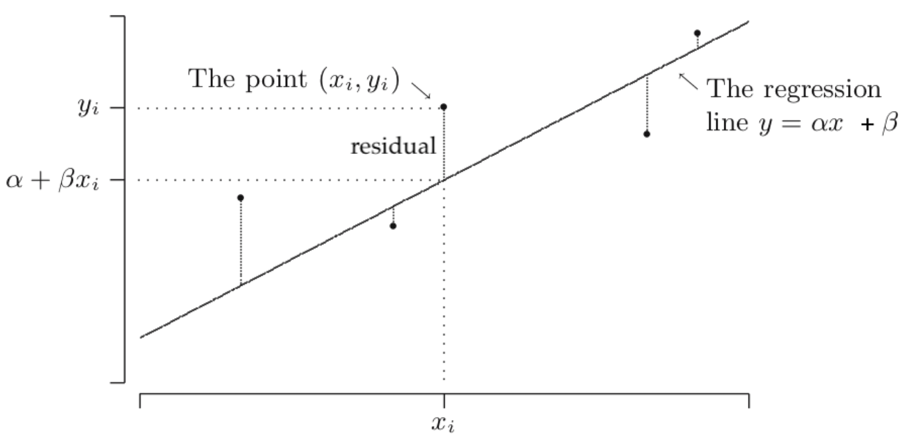
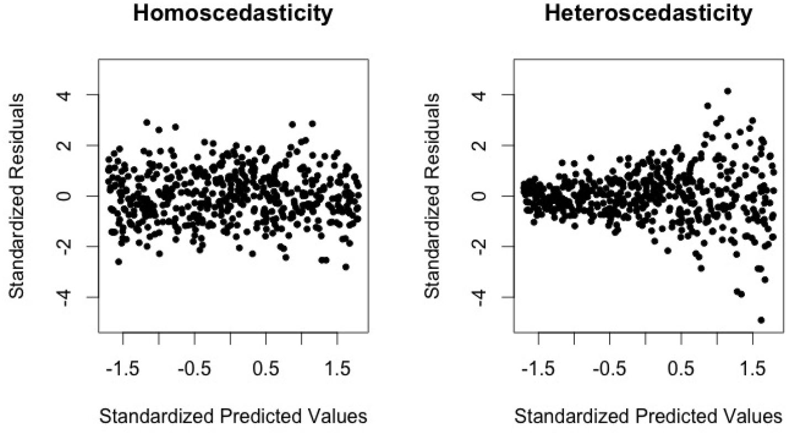

# Method of Least Squares

## The Method of Least Squares

The true line has the formula\
$ Y = \alpha + \beta x $  
The line that we find is\
$Y = \alpha + \beta x + N$  
where N is some random noise.

In a simple linear regression model for a bivariate dataset 
$(x_1, y_1), \ldots, (x_n, y_n)$, where

- $x_1, x_2, \ldots, x_n$ are non-random
- $y_1, y_2, \ldots, y_n$ are realizations of $Y_1, Y_2, \ldots, Y_n$, where
  $$
  Y_i = \alpha + \beta x_i + \text{U}_i
  $$

where $U_1, U_2, \ldots, U_n$ are independent random variables, with $E[U_i] = 0$
and $\operatorname{Var}(U_i) = \sigma^2$

The *method of least squares* says to choose $\alpha$ and $\beta$ such that the sum
of squares is minimal.

$$
S(\alpha, \beta) = \sum^{n}_{i=1}(y_i - \alpha - \beta x_i)^2
$$

The $i$th term in the sum is the squared distance in the vertical direction from
$(x_i, y_i)$ to the line $y = \alpha + \beta x$. To find the *least squares estimates*,
we differentiate $S(\alpha, \beta)$ with respect to $\alpha$ and $\beta$, and set
the derivatives equal to 0.

??? note Finding <i>α</i> and <i>β</i>
    $$
    \frac{\partial}{\partial \alpha} S(\alpha, \beta) = 0
    \Leftrightarrow
    \sum^{n}_{i=1}(y_i - \alpha - \beta x_i) = 0
    $$
    $$
    \frac{\partial}{\partial \beta} S(\alpha, \beta) = 0
    \Leftrightarrow
    \sum^{n}_{i=1}(y_i - \alpha - \beta x_i)x_i = 0
    $$
    Which is equivalent to
    $$
    \begin{align*}
    n\alpha + \beta \sum^{n}_{i=1}x_i &= \sum^{n}_{i=1}y_i \\
    \alpha \sum^{n}_{i=1}x_i + \beta \sum^{n}_{i=1}x_i^2 &= \sum^{n}_{i=1}x_i y_i
    \end{align*}
    $$
    These are two equations with two unknowns $\alpha$ and $\beta$.  
    In general, writing $\sum$ instead of $\sum^{n}_{i=1}$, we find the following formulas
    for the estimates $\hat{\alpha}$ (the *intercept*) and $\hat{\beta}$ (the *slope*):
    $$
    \begin{align*}
    \hat{\beta} &= \frac{n \sum x_i y_i - (\sum x_i) (\sum y_i)}{n \sum x_i^2 - (\sum x_i)^2} \\
    \hat{\alpha} &= \overline{y}_n - \hat{\beta} \bar{x}_n
    \end{align*}
    $$
    Since $S(\alpha, \beta)$ is an elliptic paraboloid (a "vase"), it follows that
    $(\hat{\alpha}, \hat{\beta})$ is the unique minimum of $S(\alpha, \beta)$
    (except when all $x_i$ are equal).

### Estimators for $\alpha$ and $\beta$

We denote the least squares *estimates* by $\hat{\alpha}$ and $\hat{\beta}$. It is also
quite common to denote the least squares *estimators* by $\hat{\alpha}$ and $\hat{\beta}$.

$$
\hat{\alpha} = \overline{Y}_n - \hat{\beta}\bar{x}_n, \qquad
\hat{\beta} = \frac{n \sum x_i Y_i - (\sum x_i) (\sum Y_i)}{n \sum x_i^2 - (\sum x_i)^2}
$$

$\hat{\alpha}$ is an unbiased estimator for $\alpha$ and $\hat{\beta}$ is an unbiased
estimator for $\beta$.

### Unbiased estimator for $\sigma^2$

In the simple linear regression model the random variable

$$
\hat{\sigma}^2 = \frac{1}{n-2}\sum^{n}_{i=1}(Y_i - \hat{\alpha} - \hat{\beta}x_i)^2
$$

### Residuals

The $i$th residual $r_i$ is defined as the vertical distance between the $i$th point
and the estimated regression line:

$$
r_i = y_i - \hat{\alpha} - \hat{\beta}x_i, \qquad i = 1, 2, \ldots, n
$$

When a linear model is appropriate, the scatterplot of the residuals $r_i$ against the
$x_i$ should show truly random fluctuations around zero, in the sense that it should not
exhibit any trend or pattern.

!!! note Heteroscedasticity
    The assumption of equal variance of the $U_i$ (and therefore the $Y_i$) is called
    *homoscedasticity*. In case the variance of $Y_i$ depends on the value of $x_i$, we
    speak of *heteroscedasticity*. For instance, it occurs when $Y_i$ with a large expected
    value have a larger variance than those with small expected values. This produces a
    "fanning out" effect. Possible ways out of this problem are a technique called
    weighted least squares or the use of variance-stabilizing transformations.
    
