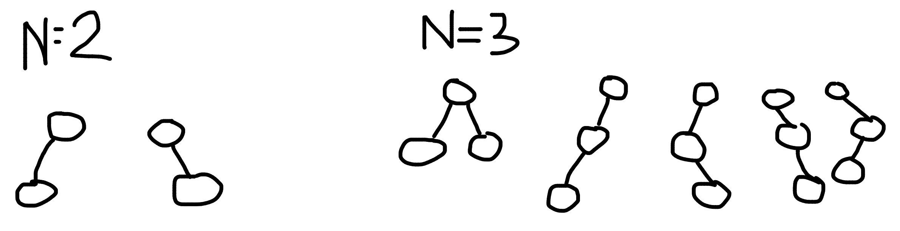
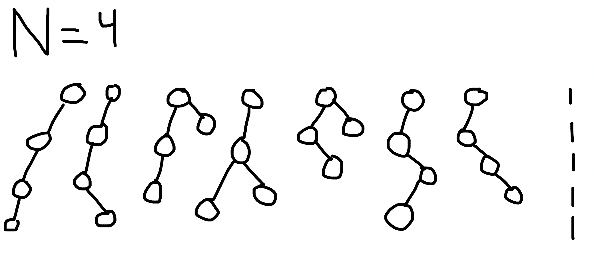
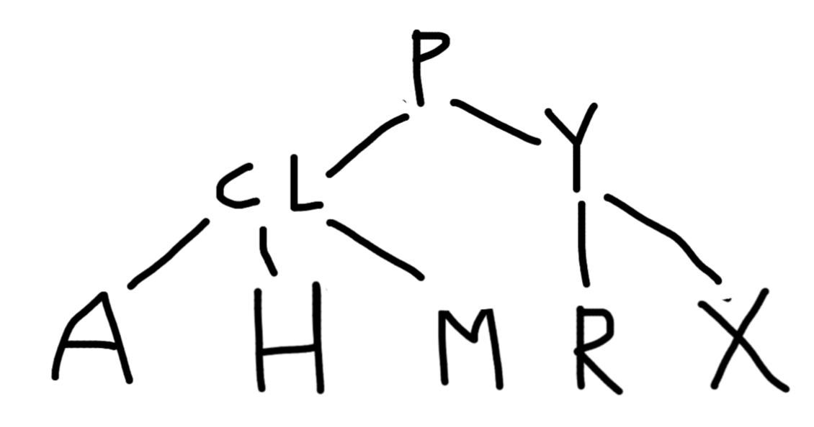
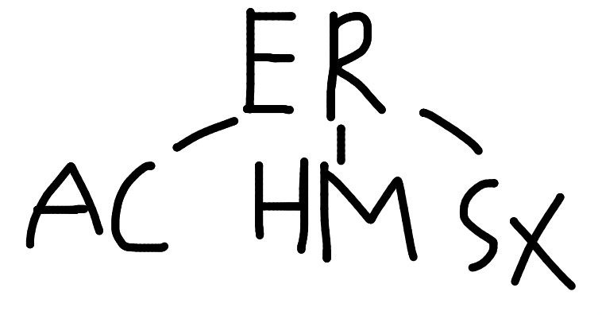
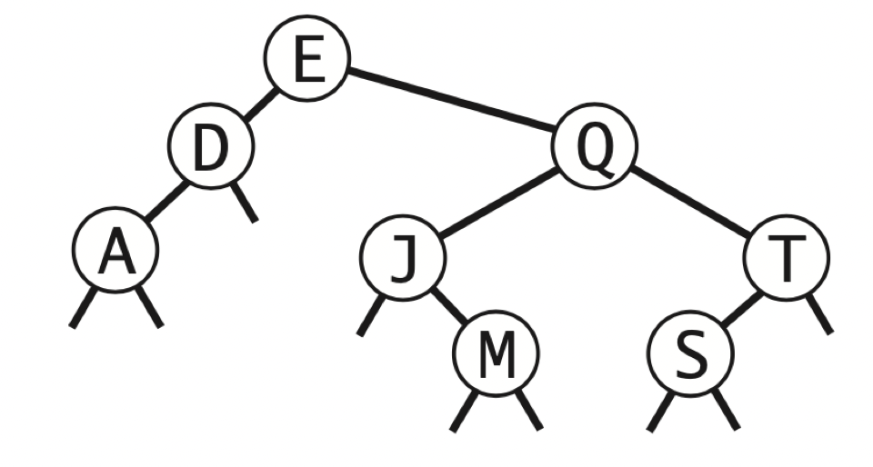
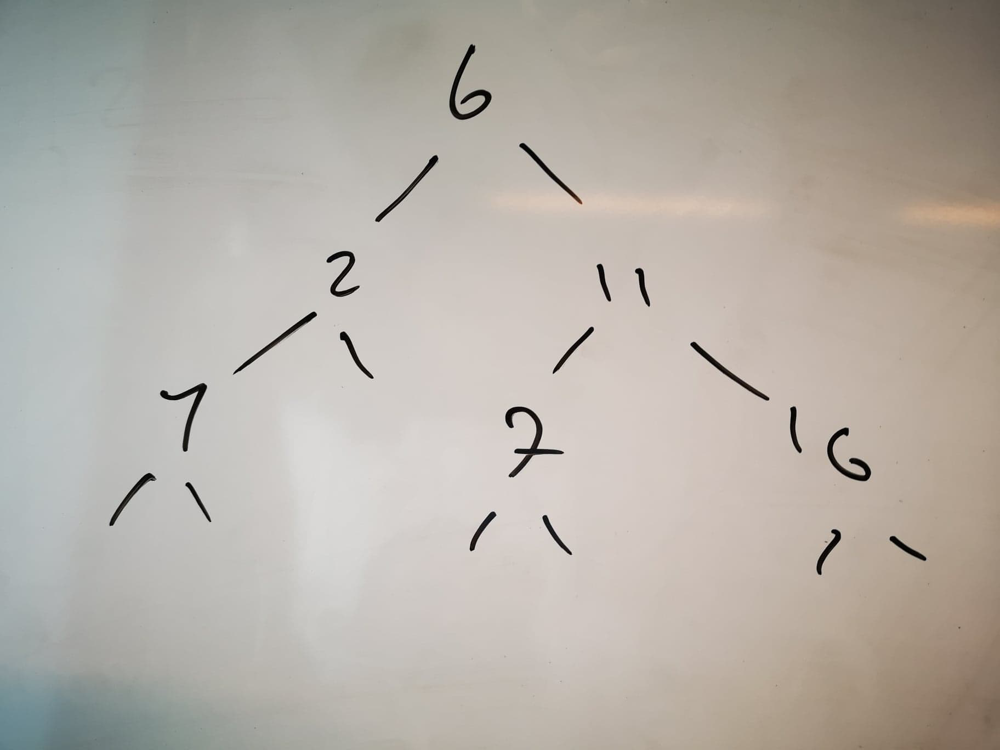
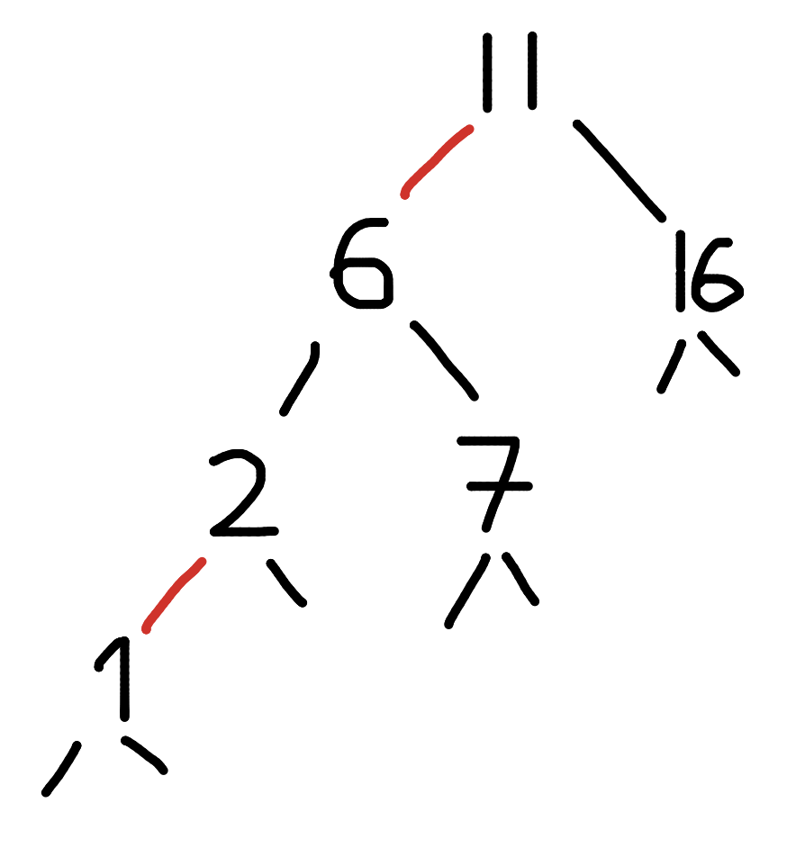

# Exercise 11

 3.2.9 

Possible shapes of BST of size N

N=4 can also be mirrored.

 3.3.2 

2-3 tree that results from inserting Y L P M X H C R A E S

 3.3.3 

Insertion order of S E A R C H X M that results in a 2-3 tree of height 1.

E R A C H M S X

 3.3.11 

Draw red-black BST resulting from inserting Y L P M X H C R A E S

 3.2.11 

There are $2^{N-1}$ different binary tree shapes of $N$ nodes with height $N-1$.

Same amount of different ways to insert $N$ keys that results in a BST of height $N-1$.

 3.2.15 

`floor("Q")` will examine E, Q.

In parenthesis: size(x.left/x.right)

`select(5)` will examine E, (D), Q, (J), (T).

`ceiling("Q")` will examine E, Q.

`rank("J")` will examine E, (D), Q, J.

`size("D", "T")` will examine first E, D, (A), then E, (D), Q, (J), T, (S).

`keys("D", "T")` will examine E, D, Q, J, M, T.

 3.2.20 

 3.2.22 

In a BST, all nodes greater than a given node must be in its right subtree.
The predecessor of a node in a BST is the rightmost node in the left subtree.
By the statement above, the rightmost node in the left subtree must have the largest
key in that subtree, as it would otherwise not be the rightmost node. From that, we
can draw the conclusion that it cannot have a right child either, as it would then
no longer be the rightmost node. It also cannot be larger than the node of interest,
as it would then no longer reside in the left subtree. The same can be proven by symmetry
for the successor having no left child.

 3.3.13 

If you insert keys in increasing order into a red-black BST, the tree height is not
monotonically increasing.

Inserting 6 2 11 16 7 1 into a BST and a red-black BST yields a BST with a lower height
than the red-black BST.

 Counting keys 

 Counting odd keys 