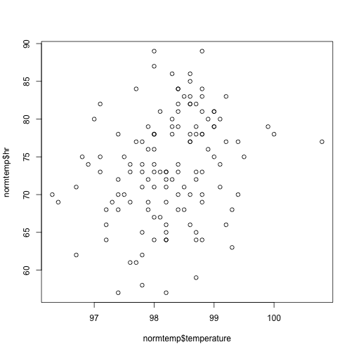
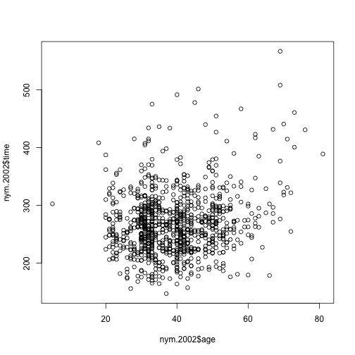
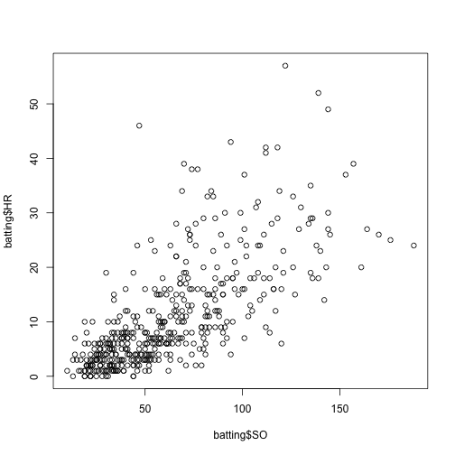
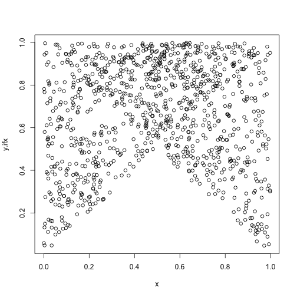
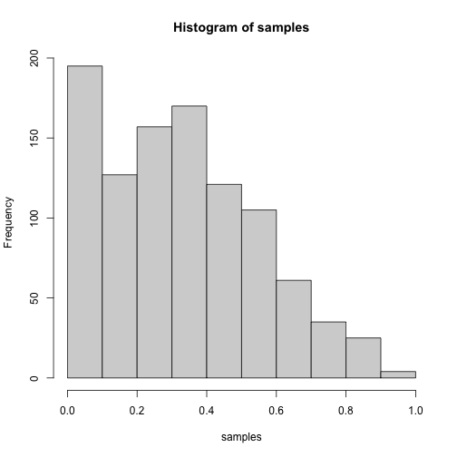
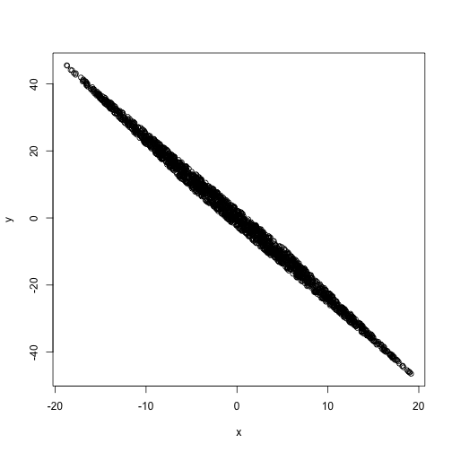
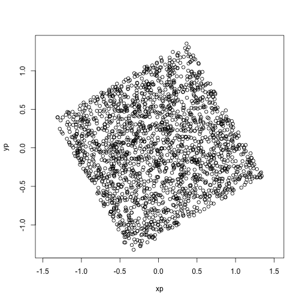
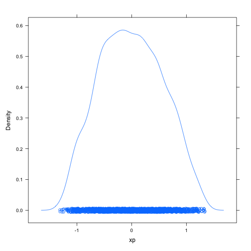
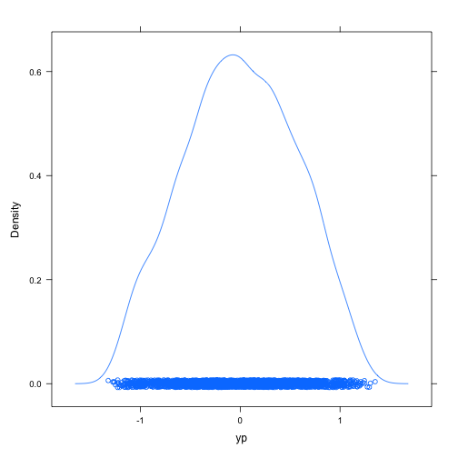
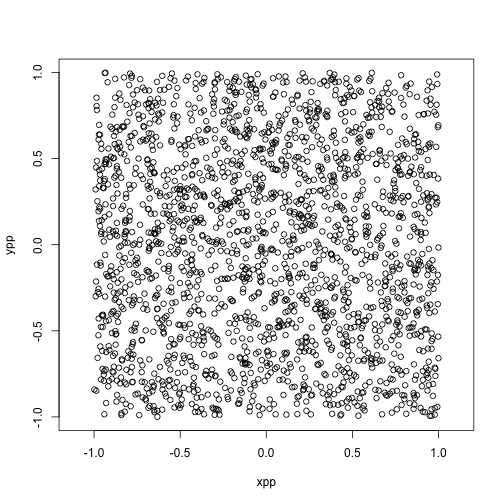

# Problems

T = Theoretical Exercise, R = R Exercise

## 1. Hair vs. Eye Colour (T)

To investigate the relations between hair color and eye colour, the hair color and eye color of 5383 was recorded. The data are given in Table 1. Eye color is encoded by the values 1 (Light) and 2 (Dark), and hair color by 1 (Fair/red), 2 (Medium), and 3 (Dark/black). By dividing the numbers in the table by 5383, the table is turned into a joint probability distribution for random variables X (hair color) taking values 1 to 3 and Y (eye color) taking values 1 and 2.

<table class="table" style="margin-left: auto; margin-right: auto;">
<caption>Relation between hair color and eye color.</caption>
 <thead>
<tr>
<th style="empty-cells: hide;border-bottom:hidden;" colspan="1"></th>
<th style="border-bottom:hidden;padding-bottom:0; padding-left:3px;padding-right:3px;text-align: center; font-weight: bold; " colspan="3"><div style="border-bottom: 1px solid #ddd; padding-bottom: 5px; ">Hair color</div></th>
</tr>
  <tr>
   <th style="text-align:left;">   </th>
   <th style="text-align:right;"> Fair/Red </th>
   <th style="text-align:right;"> Medium </th>
   <th style="text-align:right;"> Dark/black </th>
  </tr>
 </thead>
<tbody>
  <tr grouplength="2"><td colspan="4" style="border-bottom: 1px solid;"><strong>Eye color</strong></td></tr>
<tr>
   <td style="text-align:left;padding-left: 2em;" indentlevel="1"> Light </td>
   <td style="text-align:right;"> 1168 </td>
   <td style="text-align:right;"> 825 </td>
   <td style="text-align:right;"> 305 </td>
  </tr>
  <tr>
   <td style="text-align:left;padding-left: 2em;" indentlevel="1"> Dark </td>
   <td style="text-align:right;"> 573 </td>
   <td style="text-align:right;"> 1312 </td>
   <td style="text-align:right;"> 1200 </td>
  </tr>
</tbody>
</table>

(a) Determine the joint and marginal probability distributions of $X$ and $Y$.

|            |                     | **Hair color**      |                     |
| ---------- | ------------------- | ------------------- | ------------------- |
|            | Fair/Red \| 1       | Medium \| 2         | Dark/Black \| 3     |
| Light \| 1 | $\frac{1168}{5383}$ | $\frac{825}{5383}$  | $\frac{305}{5383}$  |
| Dark \| 2  | $\frac{573}{5383}$  | $\frac{1312}{5383}$ | $\frac{1200}{5383}$ |

\begin{center}
\begin{tabular}{c | c c c | c}
  & & \textbf{Hair color} \\
  & Fair/Red | 1 & Medium | 2 & Dark/Black | 3 & $P_Y$\\
  \textbf{Eye color} \\
  \hline
  \rule{0pt}{1.2em}
  Light | 1 & $0.217$ & $0.153$ & $0.057$ & $0.427$ \\
  \rule{0pt}{1.2em}
  Dark | 2 & $0.106$ & $0.245$ & $0.223$ & $0.574$ \\
  \hline
  \rule{0pt}{1.2em}
  $P_X$ & $0.323$ & $0.398$ & $0.280$ 
\end{tabular}
\end{center}


|            |               | **Hair color** |                 |         |
| ---------- | ------------- | -------------- | --------------- | ------- |
|            | Fair/Red \| 1 | Medium \| 2    | Dark/Black \| 3 | $P_Y$   |
| Light \| 1 | $0.217$       | $0.153$        | $0.057$         | $0.427$ |
| Dark \| 2  | $0.106$       | $0.245$        | $0.223$         | $0.574$ |
| $P_X$      | $0.323$       | $0.398$        | $0.280$         |         |

(b) Find out whether $X$ and $Y$ are dependent or independent. 

Independent if $P(X = x, Y = y) = P(X = x)P(Y = y)$ for all x and y.
Check for $x = y = 1$:

$$
\begin{align*}
  P(X=1, Y=1) &= 0.217 \\
  P(X=1)P(Y=1) &= 0.323 \cdot 0.427 \\
  &= 0.138
\end{align*}
$$

Since $P(X = x, Y = y) \neq P(X = x)P(Y = y)$, X and Y are dependent.

## 2. Joint distribution (T)

Let X and Y be continuous random variables with the joint probability density function

$$
\begin{equation}
  f(x,y)=
  \begin{cases}
    cx+1 & \text{if } x,y\geq 0,x+y<1 \\ 
    0 & \text{otherwise}
    \end{cases}
\end{equation}
$$

(a) Find the constant c. 

Integrate out x and y. Fix x at a value between 0 and 1, and integrate y from 0 to that value.

$$
\begin{align*}
  \int_0^1\int_0^{1-x}cx+1\;dy\;dx &= \int_0^1\left[ cxy+y \right]_0^{1-x}\;dx \\
  &= \int_0^1 cx(1-x) + (1-x) \; dx \\
  &= \int_0^1 cx - cx^2 + 1 - x \; dx \\
  &= \left[ -\frac{cx^3}{3} + \frac{cx^2}{2} - \frac{x^2}{2} + x \right]_0^1 \\
  &= -\frac{c}{3} + \frac{c}{2} - \frac{1}{2} + 1 \\
  &= \frac{c}{6} + \frac{1}{2}
\end{align*}
$$

We can now isolate c, as we know the integral integrates to 1.

$$
\begin{align*}
  \frac{c}{6} + \frac{1}{2} &= 1 \\
  \frac{c}{6} &= \frac{1}{2} \\
  c &= 3
\end{align*}
$$

(b) Compute the marginal distribution $f_X(x)$.

Integrate over the joint distribution function with respect to y in the interval $[0, 1-x]$, since $y+x<1$.

$$
\begin{align*}
  \int_0^{1-x} 3x+1 \; dy &= \left[ 3xy + y \right]_0^{1-x} \\
  &= 3x(1-x) + (1-x) \\
  &= -3x^2 + 2x + 1
\end{align*}
$$

(c) Compute $P(Y<2X^2)$.

Find the intersection between $y=2x^2$ and $1-x$

\[
2x^2 = 1-x \Leftrightarrow x = 0.5
\]

$$
\begin{align*}
  \int_0^0.5 \int_0^{2x^2} 3x+1 \; dy \; dx &= 0.177 \\
  \int_0.5^1 \int_0^{1-x} 3x+1 \; dy \; dx &= 0.375 \\
  P(Y<2X^2) &= 0.177 + 0.375 = 0.552
\end{align*}
$$

## 3. Covariance and Correlation (T)

Show that the correlation between X and Y is simply the covariance of the corresponding standardised scores, i.e, 

$$
\begin{equation}
\rho(X,Y) = \mathrm{Cov}\left [\frac{X-E[X]}{ \sqrt{\mathrm{Var}[X]}}, \frac{Y-E[Y]}{ \sqrt{\mathrm{Var}[Y]}} \right].
\end{equation}
$$

Let X and Y be two continuous random variables. 

$$
\begin{align*}
\text{Cor}(rX+s, vY+u) &= rv\text{Cov(X,Y)} \\
\frac{1}{\sqrt{\text{Var}(X)}}\frac{1}{\sqrt{\text{Var}(Y)}} &= \frac{\text{Cov}(X,Y)}{\sqrt{\text{Var}(X)\text{Var}(Y)}} \\
\frac{1}{\sqrt{\text{Var}(X)}} &- \frac{E[X]}{\sqrt{text{Var}(X)}}
\end{align*}
$$

## 4. Correlation Coefficient (R)

(a) The data set `normtemp (UsingR)` contains body measurements for 130 healthy, randomly selected individuals. The variable `temperature` measures normal body temperature, and the variable `hr` measures resting heart rate. Make a scatter plot of the two variables. What does the plot show you? Find the Pearson correlation coefficient. How does the estimate relate to the scatter plot?

```r
plot(x=normtemp$temperature, y=normtemp$hr)
```



```r
cor.test(x = normtemp$temperature, y=normtemp$hr, method="p")
```

```
## 
##  Pearson's product-moment correlation
## 
## data:  normtemp$temperature and normtemp$hr
## t = 2.9668, df = 128, p-value = 0.003591
## alternative hypothesis: true correlation is not equal to 0
## 95 percent confidence interval:
##  0.08519113 0.40802170
## sample estimates:
##       cor 
## 0.2536564
```

Does not seem to be much correlation in the scatter plot, and the Pearson correlation coefficient is also quite low.

(b) The data set `nym.2002 (UsingR)` contains information about the 2002 New York city marathon. What do you expect the correlation between age and finishing time to be? Make a scatter plot and compute the correlation coefficient. Does the result match your expectation? 

I would expect the finishing times to increase with age.

```r
plot(x=nym.2002$age, y=nym.2002$time)
```



```r
cor.test(x=nym.2002$age, y=nym.2002$time, method="p")
```

```
## 
##  Pearson's product-moment correlation
## 
## data:  nym.2002$age and nym.2002$time
## t = 6.1092, df = 998, p-value = 1.433e-09
## alternative hypothesis: true correlation is not equal to 0
## 95 percent confidence interval:
##  0.1293971 0.2489302
## sample estimates:
##       cor 
## 0.1898672
```

There does not seem to be much correlation between age and finishing time, which was not the expected outcome.

(c) The `batting` set (`UsingR`) data set contains baseball statistics for the 2002 Major League Baseball season. What is the correlation between the number of strikeouts (`SO`) and the number of home runs (`HR`)? Make a scatter plot to see whether there is any trend. Does the data suggest that in order to hit a lot of home runs one should strike out a lot?

```r
cor.test(x=batting$SO, y=batting$HR, method="p")
```

```
## 
##  Pearson's product-moment correlation
## 
## data:  batting$SO and batting$HR
## t = 20.961, df = 436, p-value < 2.2e-16
## alternative hypothesis: true correlation is not equal to 0
## 95 percent confidence interval:
##  0.6584836 0.7522326
## sample estimates:
##       cor 
## 0.7084697
```

```r
plot(x=batting$SO, y=batting$HR)
```



There is a fair correlation between the two variables.

## 5. Sampling from a Joint Probability Distribution (R)

Let $X$ and be $Y$ be continuous random variables with the joint probability density function $f(x,y)$. In general, one can draw samples $(x^{(n)},y^{(n)})$ from the joint probability density of two random variables factoring the probability density as $f(x,y)=f(y|x) f(x)$ and first drawing a sample $x^{(n)}$ for $X$ from the marginal density $f(x)$ and then the sample $y^{(n)}$ for $Y$ from the conditional density $f(y|x)$ conditioned on $x=x^{(n)}$.

Now, assume that $f(x)=1$ for $0<x<1$, $f(x)=0$ otherwise; and 

$$
\begin{equation}
f(y|x)=  \begin{cases}
                  y - x+ 1 & \text{if } -1+ x \leq y < x \\
                  -y + x + 1 & \text{if } x \leq y < 1+x \\
                  0 & \text{otherwise}
         \end{cases}
\end{equation}
$$

 Implement a computer program that draws samples from $f(x,y)$ by using the random number generator for uniformly distributed random variables in R. 
 

```r
f.yx <- function(x, y) {
  if ((-1 + x) <= y && y < x) {
    return (y - x + 1)
  } else if (x <= y && y < (1 + x)) {
    return (-y + x + 1)
  } else {
    return (0)
  }
}
sample.joint <- function (n) {
  x <- runif(n)
  y <- runif(n)
  y.ifx <- mapply(f.yx, x, y)
  plot(x, y.ifx)
  return (x * y.ifx)
}
samples <- sample.joint(1000)
```



```r
hist(samples)
```


 
## 6. Covariance, Correlatedness and Independence (R)

Load the data set by copying the data file from course webpage to your working directory and typing `load("mypnts.Rdata")`. 

```r
load("mypnts.Rdata")
```

(a) Make a scatter plot of the points. Are the $x$ and $y$ coordinates correlated?

```r
plot(mypnts)
```



The x and y coordinates seem to be strongly correlated.

(b) Estimate the *covariance matrix* of the data set. It is a $2 \times 2$ matrix containing the all the pairwise covariances, i.e., 

$$
\begin{equation}
\mathbf{C} = 
\begin{pmatrix} \mathrm{Cov}(X,X)\quad \mathrm{Cov}(X,Y)\\
                \mathrm{Cov}(Y,X)\quad \mathrm{Cov}(Y,Y)
\end{pmatrix}
\end{equation}
$$

What can you see from the covariance matrix estimate?

```r
cov(mypnts)
```

```
##            x         y
## x   68.20358 -162.3543
## y -162.35430  388.2671
```

x and y are negatively correlated with a covariance of -162.

(c) Apply the mapping

$$
\begin{equation}
x' = a x + b y \quad \text{and} \quad y'=c x + d y,
\end{equation}
$$

to the points where $a=0.07$, $b=0$, $c=1$,and $d=0.42$. This process is called *whitening*. 

```r
xp <- 0.07 * mypnts$x
yp <- mypnts$x + 0.42 * mypnts$y
```

(d) Plot the mapped points (use the option 'asp=1' that gives unity aspect ratio), and their marginal distributions (`densityplot`) on both $x'$ and $y'$ axis. Compute the covariance matrix estimate for the mapped points. Are the mapped points uncorrelated? How about independent? Can you see why the mapping is called whitening?

```r
plot(xp, yp, asp=1)
```



```r
densityplot(xp)
```



```r
densityplot(yp)
```



```r
cov(data.frame(xp, yp))
```

```
##             xp          yp
## xp 0.334197555 0.001034248
## yp 0.001034248 0.316283824
```

The mapped points have a much lower covariance than before.
They are also not independent, as the covariance is not 0.
When you know x, you can narrow down the possible values of y.

(e) Apply rotation to the mapped points 

$$
\begin{equation}
x'' = cos(\alpha) x' - sin(\alpha) y' \quad \text{and} \quad y''=sin(\alpha) x' +  cos(\alpha)y',
\end{equation}
$$

where $\alpha=-\pi/6$.

Plot the rotated, mapped points, and the marginals on the new axes. Are the rotated, mapped coordinates uncorrelated? How about independent? 

```r
alpha <- -pi/6
xpp <- cos(alpha) * xp - sin(alpha) * yp
ypp <- sin(alpha) * xp + cos(alpha) * yp
plot(xpp, ypp, asp=1)
```



```r
cov(data.frame(xpp, ypp))
```

```
##              xpp          ypp
## xpp  0.330614807 -0.007239749
## ypp -0.007239749  0.319866571
```

The variables are still fairly uncorrelated but not independent. 
The covariance is in the same order of magnitude as before the rotation.

(f) What did you learn from this exercise? Does the result generalize?

Transforming a highly correlated and dependant dataset into an (almost) independant, uncorrelated one.
