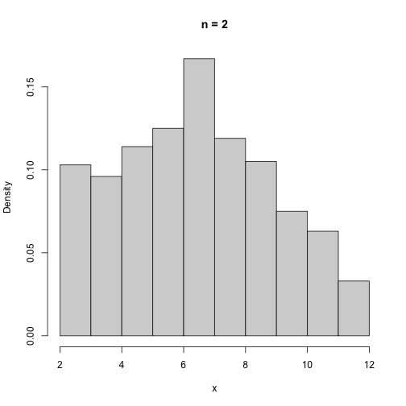
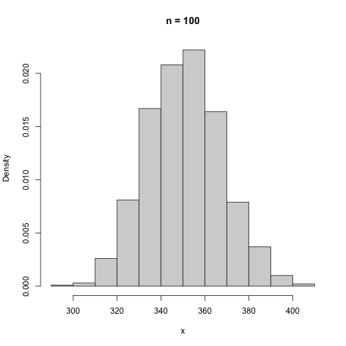
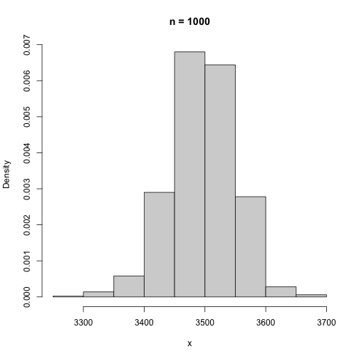
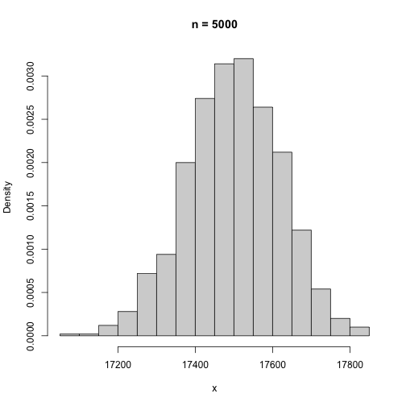
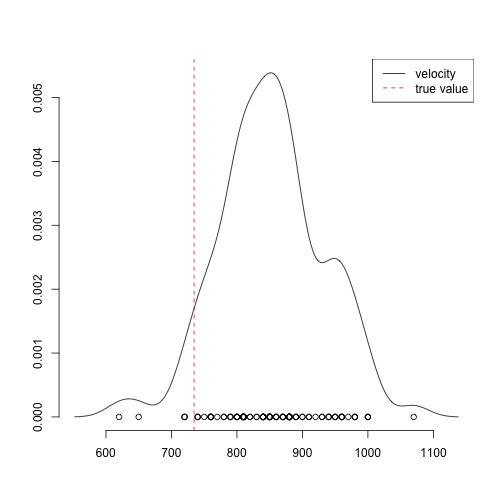
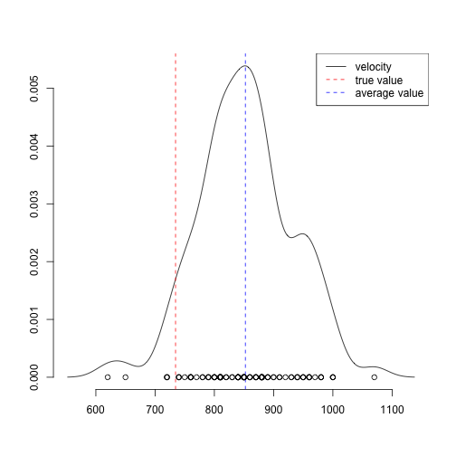
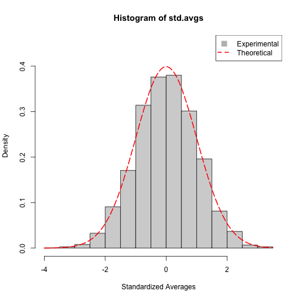

# Problems 

T=Theoretical Exercise, R=R-Exercise

## 1. Sum of Bernoulli Distributed Variables (T)

Let $X$ and $Y$ be two independent random variables where $X \sim \mathrm{Ber}(p)$ and $Y \sim \mathrm{Ber}(q)$. Let $Z=X+Y$. Investigate how $Z$ is distributed by deriving the probability mass function for $Z$.

$$
\begin{align*}
P_X(x) &= \begin{cases}
  p &\text{if } x=1 \\
  1-p &\text{if } x=0 \\
  0 &\text{otherwise}
\end{cases} \\
P_Y(y) &= \begin{cases}
  q &\text{if } y=1 \\
  1-q &\text{if } y=0 \\
  0 &\text{otherwise}
\end{cases} \\
P_Z(c) &= \sum_j p_X(c-b_j)p_Y(b_j) \\
P_Z(c) &= \begin{cases}
  p_X(0)(1-q) + p_X(-1)q = (1-p)(1-q) &\text{if } c = 0 \\
  p_X(1)(1-q) + p_X(0)q = p(1-q) + (1-p)q &\text{if } c = 1 \\
  p_X(2)(1-q) + p_X(1)q = pq &\text{if } c = 2 \\
  0 &\text{otherwise}
\end{cases}
\end{align*}
$$

## 2. Casino La Cella Fortuna (T)

The casino La bella Fortuna is for sale and you think you might want to buy it, but you want to know how much money you are going to make. All the present owner can tell you is that the roulette game Red or Black is played about 1000 times a night, 365 days a year. Each time it is played you have probability 19/37 of winning the player’s bet of 1 EUR and probability 18/37 of having to pay the player 1 EUR.

Explain in detail why the law of large numbers can be used to determine the
income of the casino, and determine how much it is.

Over time the income will average out to the mean, with enough observations. Because there are so many games,
the average will be the expected yearly income. The number of observations is

$$
1000\cdot365 = 365,000
$$

The average here is

$$
\mu = 365,000\cdot\frac{19}{37} - 365,000\cdot\frac{18}{37} = \frac{365,000}{37} \approx 9865
$$

The expected yearly income of the casino is 9865 EUR. 

$$
\begin{align*}
X &\sim Ber(x) = \begin{cases}
  19/37 &\text{if } x = 1 \\
  18/37 &\text{if } x = -1 \\
  0 &\text{otherwise}
\end{cases} \\
E[X] &= \frac{19}{37}\cdot 1 + \frac{18}{37}\cdot (-1) \\
&= \frac{1}{37} \\
\mu &= 365000 \cdot E[X] \approx 9865
\end{align*}
$$

## 3. Central Limit Theorem (T)

Let $X_1, X_2,\ldots$ be a sequence of independent $N(0, 1)$ distributed random
variables. For $n = 1,2, \ldots$, let $Y_n$ be the random variable, defined by
$Y_n = X_1^2 + \ldots + X_n^2$.

(a) Show that $E[X_i^2]=1.$

$$
\begin{align*}
Var[X] &= E[X^2] - E[X]^2 \\
1 &= E[X^2] - 0 \\
E[X^2] &= 1
\end{align*}
$$

(b) One can show—using integration by parts—that $E[X_i^4]=3$. Deduce from this that $\mathrm{Var}(X_i^2)=2.$

$$
\begin{align*}
  E[X^4] &= 3 \\
  Var[X^2] &= E[X^4] - E[X^2]^2 \\
  Var[X^2] &= 3 - 1 = 2
\end{align*}
$$

(c) Use the central limit theorem to approximate $P(Y_{100} > 110)$.

$$
\begin{align*} 
Z_n &= \sqrt{n} \frac{\overline{X}_n-\mu}{\sigma} \\
Z_n &= \sqrt{n} \frac{\overline{Y}_{100}-100\cdot E[X^2]}{\sigma_{X^2}} \\
\mu &= E[X^2_i] = 1 \\
\sigma &= \sqrt{Var[X^2_i]} = \sqrt{2} \\
Z_{100} &= 10 \cdot \frac{Y_{100}/100 - 1}{\sqrt{2}} \\
&= 10 \cdot \frac{110/100 - 1}{\sqrt{2}} \\
&= \frac{11}{\sqrt{2}} - \frac{10}{\sqrt{2}} = \frac{1}{\sqrt{2}}
\end{align*}
$$

$$
\begin{align*}
P(Y_{100} > 110) &= P\left(Z_{100} > \frac{1}{\sqrt{2}}\right) \\
&\approx 1 - \Phi_Z\left(\frac{1}{\sqrt{2}}\right) \approx 0.455
\end{align*}
$$

\[
\lim_{n\to\infty} F_{Z_n} = \Phi(0,1)
\]

## 4. Sum of Random Variables (R)

Assume you have $n$ dice you throw simultaneously. The sum of outcomes can be characterized by the formula $X=X_1+X_2+...+X_n$. Simulate the sum for thousand times using a couple of different values for $n$. Plot the histogram of the outcomes (`hist`) for each values of $n$ you chose. What is the distribution like when $n=2$? What can you see when you increase $n$?  


```r
sum.dice <- function(n) {
  return (sum(sample(1:6, n, replace=TRUE)))
}
plot.xn <- function(n) {
  x <- sapply(rep(n, 1000), sum.dice)
  hist(x, main=sprintf("n = %d", n), freq=FALSE)
}
n.vals <- c(2, 100, 1000, 5000)
sapply(n.vals, plot.xn)
```






The distribution tends towards a normal distribution. The sum of normal distributions is also normally distributed.

## 5. Michelson Experiment (R)


```r
library(UsingR)
```

In 1879, A.A. Michelson made a famous experiment to determine the speed of light, the data set is available as `Michelson(HistData)`. The velocity estimates are $v=299000 \mathrm{km}/\mathrm{s} + \delta v$ where $\delta v$ is the velocity value saved in the data set. 

(a) Study the examples shown by typing '?Michelson'.

```r
?Michelson
```

A data frame with 100 observations with the variable velocity in order of data collection. The numbers with 299,000 added to 
them are Michelson's measurements of the speed of light in km/sec. The "true" value is 734,5.

(b) Make density plot of the measurements together with data together with the individual estimates and true speed of light.


```r
DensityPlot(Michelson, do.legend=FALSE)
abline(v=734.5, col="red", lty=2)
points(x=Michelson$velocity, y=rep(0, length(Michelson$velocity)))
legend(x="topright", legend=c("velocity", "true value"),
       lty=c(1, 2), col=c("black", "red"))
```




(c) Assume that the velocity estimates are independent and identically distributed. Compute an estimate for the speed of light and compare to the true value known today. Add the estimate to the plot.


```r
avg <- mean(Michelson$velocity)
DensityPlot(Michelson, do.legend=FALSE)
abline(v=734.5, col="red", lty=2)
abline(v=avg, col="blue", lty=2)
points(x=Michelson$velocity, y=rep(0, length(Michelson$velocity)))
legend(x="topright", legend=c("velocity", "true value", "average value"),
       lty=c(1, 2, 2), col=c("black", "red", "blue"))
```




(d) Use Chebychev's inequality to find out an upper bound for the probability that the speed of light was equal or further away from the value known today. 

$$
  P(\lvert Y-E[Y]\rvert \geq a) \leq \frac{1}{a^2}\operatorname{Var}(Y)
$$

```r
mich_a <- mean(Michelson$velocity)-734.5
mich_var <- var(Michelson$velocity)
result <- 1/mich_a^2*mich_var
result
```

```
## [1] 0.4490995
```


(e) After looking closer at the data set do you have any reservations about the assumptions made above?

Velocities of the same values were often recorded right after each other, sometimes multiple times in a row. So the assumption 
that the observations are independent might not be correct.

## 6. Central Limit Theorem (R)

As a simulated experiment, draw $n$ independent samples from Gamma distribution with shape parameter $a=7.1$ and scale parameter $s=1.44$, that is, $X_i\sim \Gamma(a,s)$, $i=1,2,\ldots,n$. Repeat the experiment $m$ times 

(a) Use the central limit theorem to compare the sample mean and variance of the standardized average to the theoretic values.

Theoretical values:

$$
\begin{align*}
  \mu &= a\cdot s \\
  &= 7.1 \cdot 1.44 = 10.224 \\
  \sigma^2 &= a\cdot s^2 \\
  &= 7.1 \cdot 1.44^2 = 14.72256
\end{align*}
$$

```r
zn <- function(n) {
  x <- rgamma(n, 7.1, scale=1.44)
  return (sqrt(n) * (mean(x) - 10.224)/sqrt(14.72256))
}
n <- 10000
m <- 3000
std.avgs <- sapply(rep(n, m), zn)
mean(std.avgs)
```

```
## [1] 0.008488304
```

```r
var(std.avgs)
```

```
## [1] 0.9894427
```


The standardized average should converge on the N(0,1) normal distribution, therefore the theoretical values for the sample mean and 
variance for the standardized average is $\mu=0$ and $\sigma^2=1$. It is clear that the experimental data are close to the theoretical values.


(b) Plot the histogram for the standardized average. How far are you from the theoretic density that you will get on the limit?

```r
hist(std.avgs, freq=FALSE, xlab="Standardized Averages", ylim=c(0, 0.45))
curve(dnorm(x, 0, 1), add=TRUE, col="red", lwd=2, lty=5)
legend(x="topright", legend=c("Experimental", "Theoretical"), col=c("black", "red"), lty=c(0, 2), lwd=c(0, 2), pch=c(22, NA), pt.cex=2, pt.bg=c("grey", NA))
```



You can see on the histogram, that the density of the standardized average is not far off the theoretical density.
