## 1. Mean and median of two datasets (Theory)

Consider two datasets $x_1, \dots, x_n$ and $y_1, \dots, y_m$. Note that they have different lengths. Let $\bar{x}$ be the sample mean of the first, and $\bar{y}$ the sample mean of the second. Consider the combined dataset $x_1, \dots, x_n, y_1, \dots, y_m$ with $m + n$ elements, obtained by concatenating the two original datasets.

 a. Is it true that the sample mean of the combined dataset is equal to $\frac{\bar{x} + \bar{y}}{2}$? If yes, provide a proof, if no, provide a counterexample.
 
No, that is not the case. For instance;

```r
x <- rnorm(100)
y <- rnorm(80)
(mean(x) + mean(y))/2
```

```
## [1] 0.03342963
```

```r
mean(c(x,y))
```

```
## [1] 0.03806185
```
 
 b. Consider the case where $m = n$, i.e. the two datasets have the same size. In this special case, is the sample mean of the combined dataset equal to $\frac{\bar{x} + \bar{y}}{2}$? If yes, provide a proof, if no, provide a counterexample.
 
```r
x <- rnorm(100)
y <- rnorm(100)
(mean(x) + mean(y))/2
```

```
## [1] 0.04761438
```

```r
mean(c(x,y))
```

```
## [1] 0.04761438
```

$$
\begin{align*}
  \bar{x} + \bar{y} &= \frac{x_1 + \ldots + x_n}{n} + \frac{y_1 + \ldots + y_n}{n} \\
  &= \frac{x_1 + \ldots + x_n + y_1 + \ldots + y_n}{n} \\
  \frac{\bar{x} + \bar{y}}{2} &= \frac{x_1 + \ldots + x_n + y_1 + \ldots + y_n}{2n} \\
\end{align*}
$$

By definition the mean of the combined dataset of x and y, as it has 2n samples.

 c. Consider now the sample medians $Med_x$ and $Med_x$ of the two datasets, in the general case of $m \ne n$. Is it true that the sample median of the combined dataset is equal to $\frac{Med_x + Med_y}{2}$? If yes, provide a proof, if no, provide a counterexample.
 
No, that is not the case.

```r
x <- rnorm(100)
y <- rnorm(70)
(median(x) + median(y))/2
```

```
## [1] -0.07578588
```

```r
median(c(x,y))
```

```
## [1] -0.08214545
```

 d. In the special case of $m = n$, is the sample median of the combined dataset is equal to $\frac{Med_x + Med_y}{2}$? If yes, provide a proof, if no, provide a counterexample.
 
Also not true in the case that $m = n$.


```r
x <- rnorm(100)
y <- rnorm(100)
(median(x) + median(y))/2
```

```
## [1] -0.1247022
```

```r
median(c(x,y))
```

```
## [1] -0.1519924
```

## 2. Recognizing plots (Theory)

Consider the following distributions:

 - $N(0,1)$
 - $N(0, 8)$
 - $N(5, 2)$
 - $Exp(2)$
 - $Exp(1/2)$

The following plots report histograms, kernel density estimates, and empirical distribution functions, each for a different dataset of 150 points generated from the above distributions.
For each plot, say which type of plot it is (i.e. if it's a histogram, a kernel density estimate or an empirical distribution function), and identify from which of the above distributions it was generated.

Datasets:

 - Dataset 1: Empirical distribution function, generated by $N(0,1)$
 - Dataset 2: Kernel density estimate, generated by $N(0,1)$
 - Dataset 3: Histogram, generated by $Exp(2)$
 - Dataset 4: Kernel density estimate, generated by $Exp(1/2)$
 - Dataset 5: Histogram, generated by $N(0,8)$
 - Dataset 6: Histogram, generated by $N(5,2)$
 - Dataset 7: Kernel density estimate, generated by $Exp(1/2)$
 - Dataset 8: Empirical distribution function, generated by $Exp(1/2)$
 - Dataset 9: Kernel density estimate, generated by $N(5,2)$
 - Dataset 10: Empirical distribution function, generated by $N(5,2)$
 - Dataset 11: Empirical distribution function, generated by $Exp(2)$
 - Dataset 12: Histogram, generated by $Exp(2)$

## 3. Chopsticks factory (Theory)

You are running a chopstick factory: due to the production process, the chopsticks are not of the exactly same length. As part of quality control you want to check that all chopsticks have approximately the same length.
Suppose you produce 2000 chopsticks each day:

 a. Choose an appropriate model for the chopsticks length. _Hint_: consider the model usually used to account for random variations in productions, experimental measures, etc.
 
The appropriate model for the chopstick length would be a normal distribution $X \sim N(\mu, \sigma^2)$
 
 b. Let $x_i$ be the length of the $i$-th chopstick produced today. At the end of the day you see that $\sum_i x_i = 45999$ and $\sum_i x_i^2 = 1058019$. Estimate $\mu$ and $\sigma^2$ for the distribution you chose in point a. _Hint_: look closely at how the variance is estimated and rework the formula so to be able to use the available data.
 
 ```math
 \begin{align*}
   \bar{x} &= \frac{45999}{2000} \approx 229.995 \\
   S^2_n &= \frac{1}{n-1} \sum^{n}_{i=1} x^2_i - 2x, \bar{x} + \bar{x}^2 \\
   &= \frac{1}{n-1} \left( \sum^{n}_{i=1} (x_i^2) - 2\bar{x} \sum^{n}_{i=1}(x_i) + n\bar{x}^2 \right) \\
   &= \frac{1}{1999} (1058019 - 2\cdot 22.99 \cdot 45999 + 2000 \cdot 22.99^2) \\
   &= \frac{64.99}{1999} \approx 0.0326
 \end{align*}
 ```
 
 c. Give an estimate of the probability that the length of a random chopstick is within the interval $[22.5, 23.5]$.
 
```r
pnorm(23.5, 22.99, sqrt(0.0326)) - pnorm(22.5, 22.99, sqrt(0.0326))
```

```
## [1] 0.994308
```
 
## 4. Sample Statistics (R)

Consider the `firstchi` dataset, available in the `UsingR` package, which you can load using the `library(UsingR)` statement. Using R functions, compute the following numerical statistics for the dataset. 
 
 - the sample mean
 - the sample variance
 - the 30th empirical percentile
 - the median
 - the MAD
 - the IQR
 
You can refer to Section 2.3 of _Using R for introductory statistics_.


```r
mean(firstchi)
```

```
## [1] 23.97701
```

```r
var(firstchi)
```

```
## [1] 39.11574
```

```r
quantile(firstchi, 0.3)
```

```
## 30% 
##  21
```

```r
median(firstchi)
```

```
## [1] 23
```

```r
mad(firstchi)
```

```
## [1] 4.4478
```

```r
IQR(firstchi)
```

```
## [1] 6
```

 
## 5. Plotting distributions (R)
 
The `diamond` dataset of the `UsingR` package contains the price in Singapore dollars of 48 diamond rings, along with their size in carats.

 1. Plot the kernel density estimate of prices. Try different bandwidths. How many modes are there? Look also at the empirical cumulative distribution function. Discuss your findings.
 

```r
dplot <- function (bw) {
  plot(density(diamond$price, bw=bw),
       main=sprintf("KDE of 48 diamond prices with bandwidth %d", bw),
       xlab="Diamond Price")
}
plot(density(diamond$price, bw="SJ"), 
     main="KDE of 48 diamond prices with default bw")
```

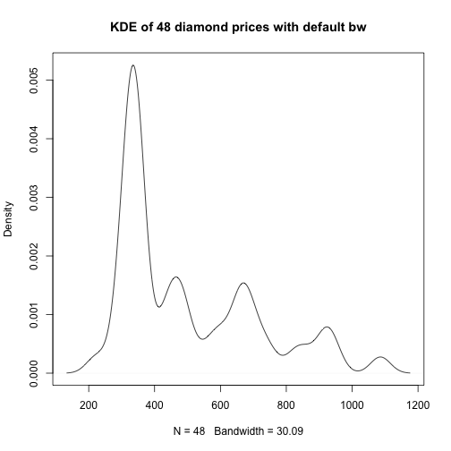

```r
sapply(c(1, 3, 5, 10, 15), dplot)
```

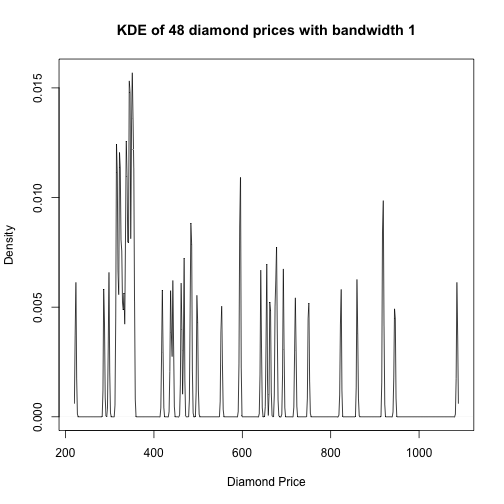
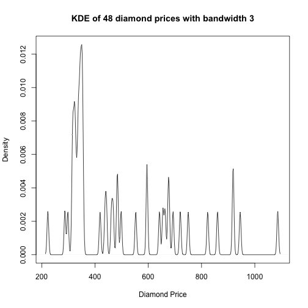
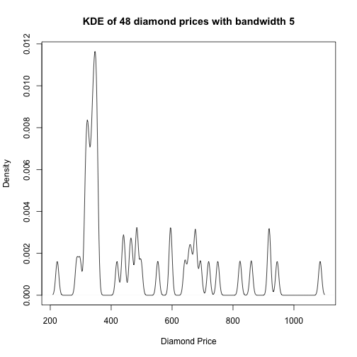
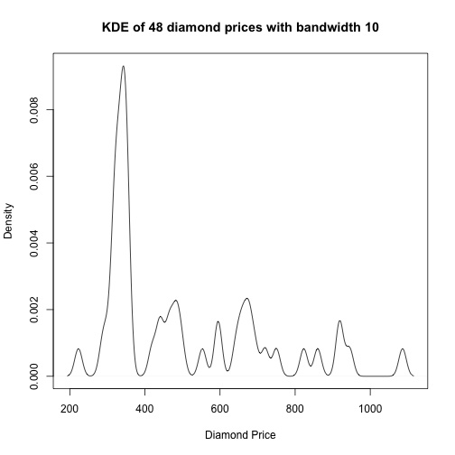
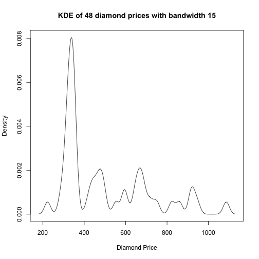

```r
plot(ecdf(diamond$price), 
     main="ECDF of 48 diamond prices", 
     xlab="Diamond Price", 
     ylab="F(x)")
```

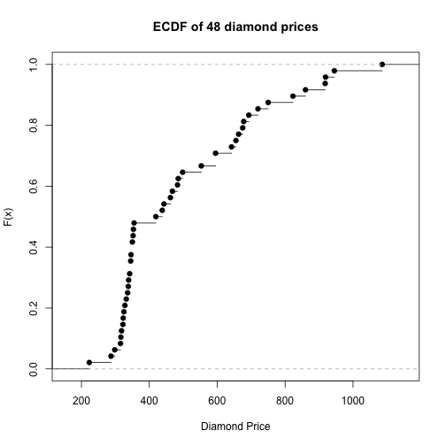

There seem to be one main mode and around 3 less significant modes.


 2. Plot a scatterplot of prices versus sizes. Does any relation between the two quantities show up?
 

```r
plot(diamond$carat, diamond$price)
```

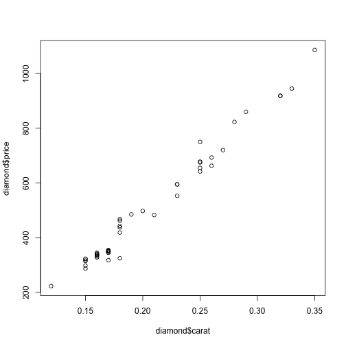

It would seem that the price goes up as the size goes up.

```r
cor(diamond$carat, diamond$price)
```

```
## [1] 0.9890707
```

 
## 6. New York marathon (R)

The `nym.2002` dataset (in the UnsingR package) contains information about the times taken by participants of the 2002 New York marathon, along with information like age and gender.
First of all, bring the dataset into scope by loading the UsingR library: `library(UsingR)`.

 a. Plot the kernel density estimate of the `time` column. Given that we have other information available in the dataset, is such a histogram informative? Discuss about this.
 

```r
plot(density(nym.2002$time))
```

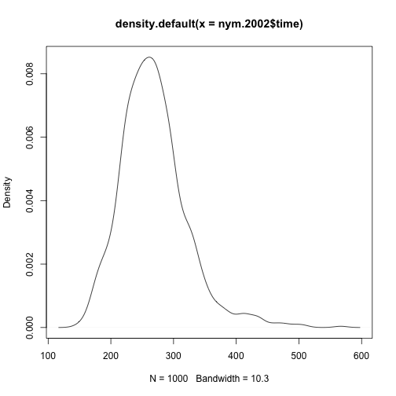

It is useful to get an idea of how long it typically took people to complete the marathon. But it does not tell us anything about which groups 
took longer or shorter, it is very general.
 
 b. Consider the variable age in combination with `time`. Compute the median time for each age group. To this end, you can use the `aggregate` function, which takes two vectors of the same length (the first one are the values, the other the grouping variables) and a function to aggregate the values belonging to the same group.
 Build the following plot: on the $x$ axis we have the age, and on the $y$ axis we have the corresponding median time. What do you observe?
 

```r
aggregate(nym.2002$time, by=list(nym.2002$age), FUN=median)
```

```
##    Group.1        x
## 1        5 302.6833
## 2       18 408.3333
## 3       20 284.0833
## 4       21 267.0500
## 5       22 256.2667
## 6       23 243.7667
## 7       24 279.1250
## 8       25 245.4833
## 9       26 227.8000
## 10      27 255.8833
## 11      28 231.2750
## 12      29 273.6083
## 13      30 251.8500
## 14      31 265.2833
## 15      32 255.0667
## 16      33 265.3000
## 17      34 264.6000
## 18      35 269.8167
## 19      36 255.6167
## 20      37 260.3500
## 21      38 248.7750
## 22      39 263.4167
## 23      40 258.8167
## 24      41 253.7500
## 25      42 251.7833
## 26      43 258.5000
## 27      44 253.5667
## 28      45 257.0500
## 29      46 256.7167
## 30      47 270.5000
## 31      48 258.6167
## 32      49 271.8000
## 33      50 278.1167
## 34      51 272.2167
## 35      52 291.3417
## 36      53 249.3833
## 37      54 266.1083
## 38      55 293.5583
## 39      56 266.2333
## 40      57 257.3583
## 41      58 319.2083
## 42      59 268.3333
## 43      60 268.7083
## 44      61 247.7500
## 45      62 312.5000
## 46      63 288.2667
## 47      64 227.4167
## 48      65 308.0167
## 49      66 240.5500
## 50      67 291.2417
## 51      69 376.6500
## 52      70 322.9833
## 53      71 372.9167
## 54      72 288.3500
## 55      73 430.7583
## 56      76 430.8167
## 57      81 389.0000
```

```r
plot(aggregate(nym.2002$time, by=list(nym.2002$age), FUN=median))
```

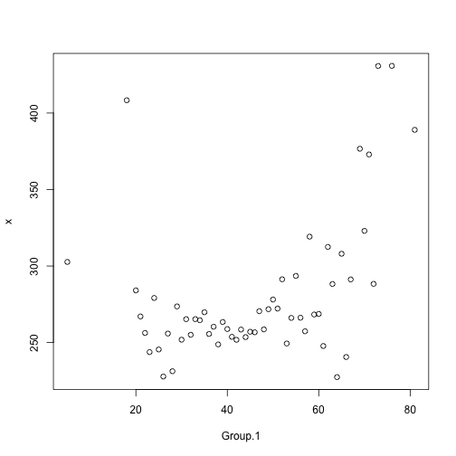
There does not seem to be a linear correlation between age and finish time. However, past the age of ~55 there is a decline in finishing time that could look linear.
 
 c. Plot the kernel density estimate for each age group. To do so, you can use the following tools:
 
   1. Get the set of ages in the dataset using the `unique` function on the `age` column of the dataframe
   2. Select the rows corresponding to an age using the `subset` function, which is described on page 159 of Verzani's book. In short, you can use `subset(dataframe, subset = column_name == value)` to select all the rows with the given `value` in the column `column_name`.

```r
plot.kde.age <- function (n) {
  df <- subset(nym.2002, age == n)
  if (dim(df)[1] > 1) {
    plot(density(df$time),
         main=sprintf("KDE of age group %d", n),
         xlab="Finish time")
  }
}
unique(nym.2002$age) %>% sort() %>%
sapply(., plot.kde.age)
```

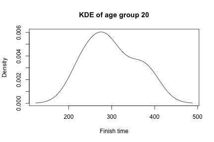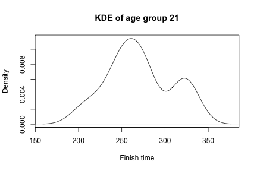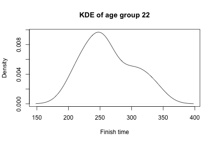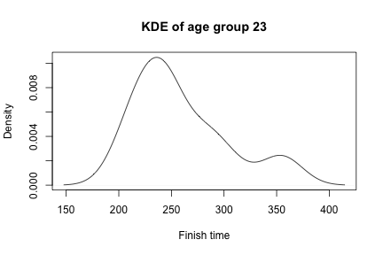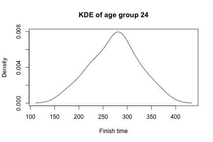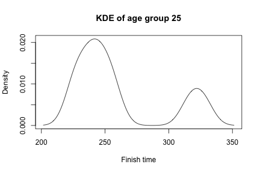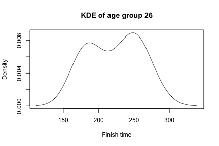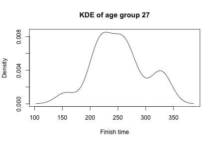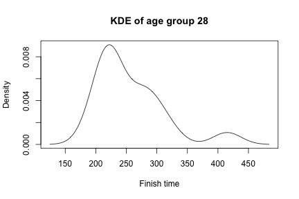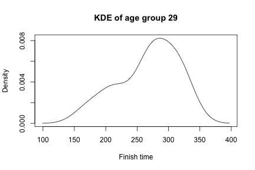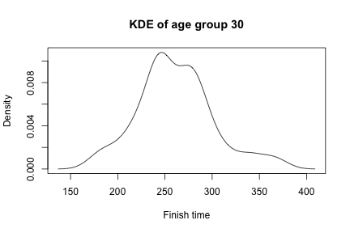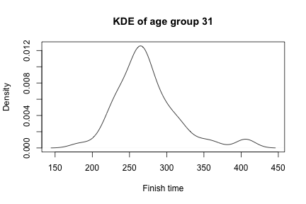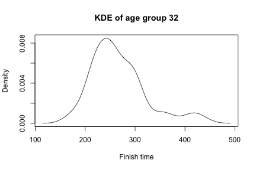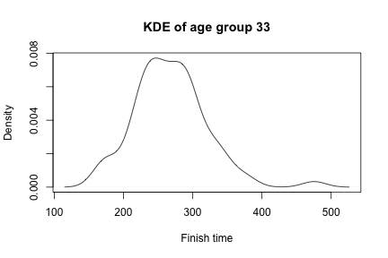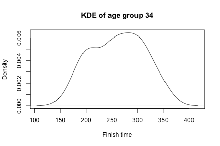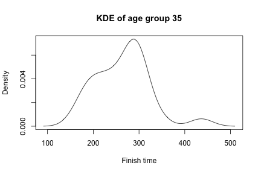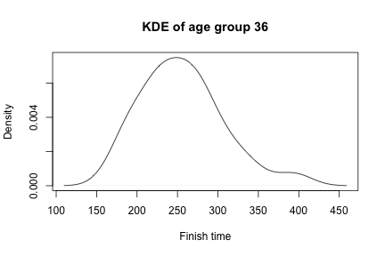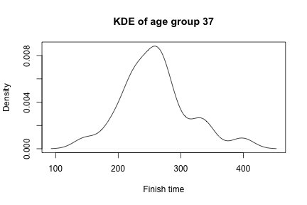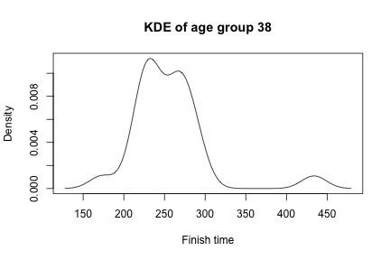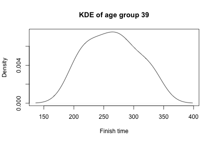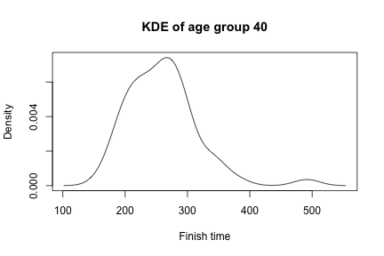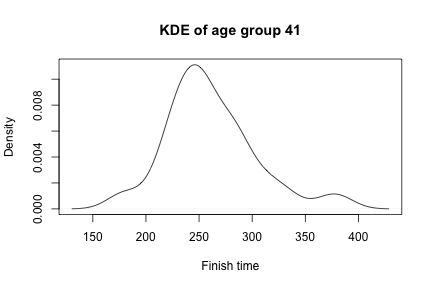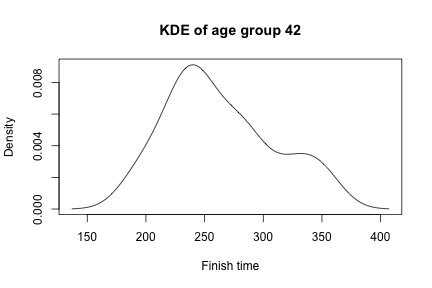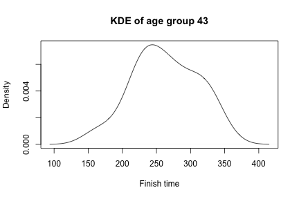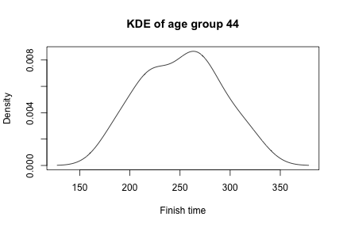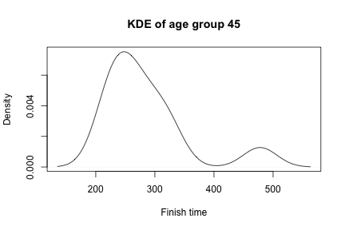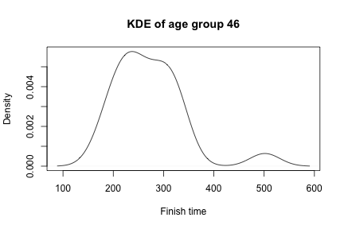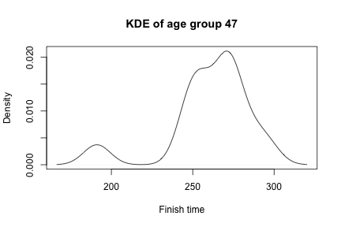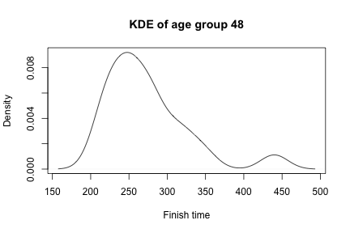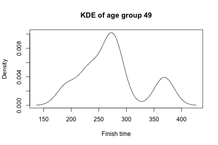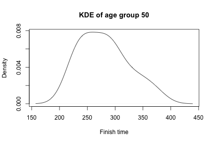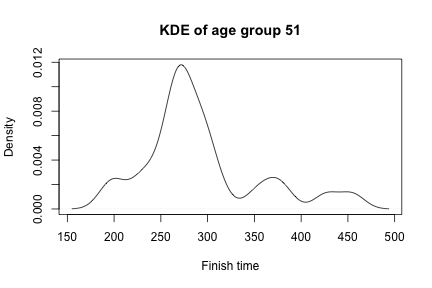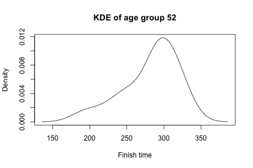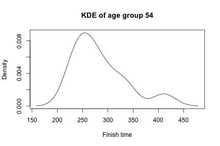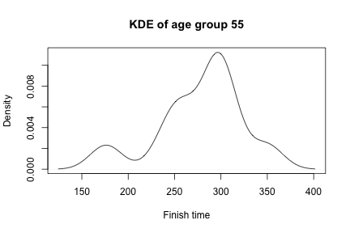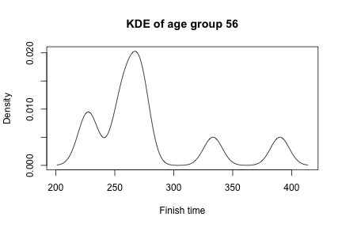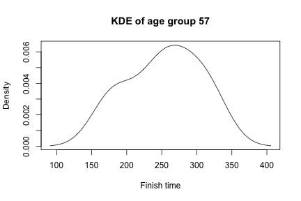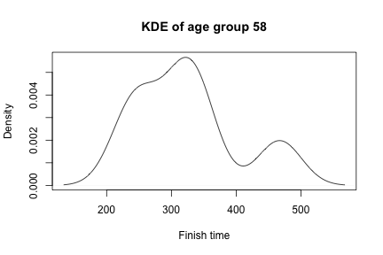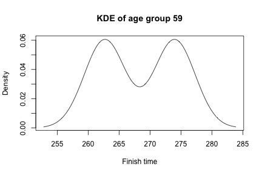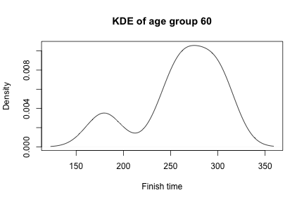

 What do you observe in the plots? What might be a possible explanation? Is the median used in the previous point a good summary for each group?

Many groups have multiple modes, so the median might not be the best summary for every group. Though for some groups, it would be fine.
