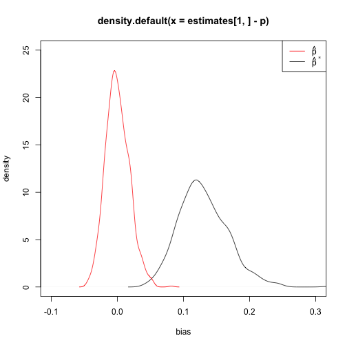
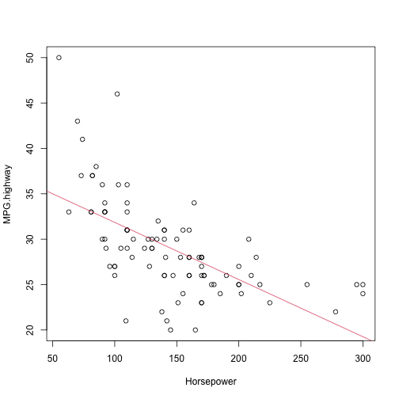
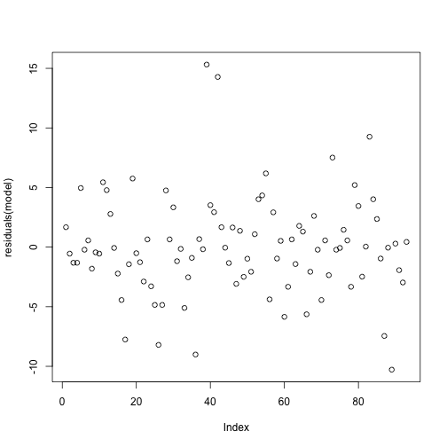
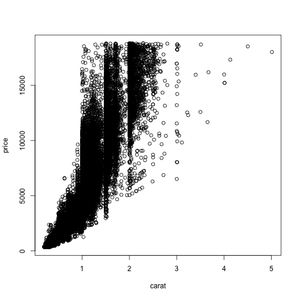
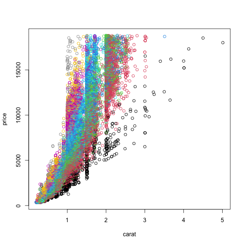
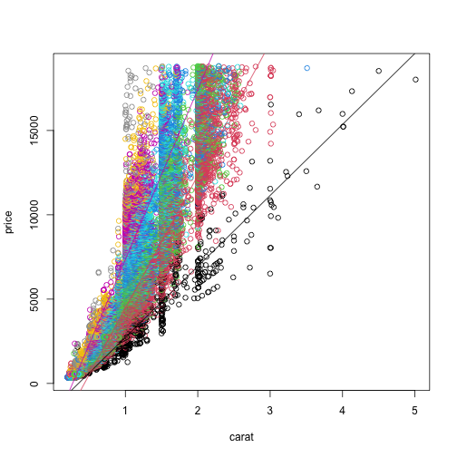

# Exercise 10

## 1. Maximum likelihood estimator for geometric random variables (Theory)

The geometric random variable, as presented in the textbook, has the following probability mass function

$$
   Pr[X = k] = (1-p)^{k-1}\cdot p
$$

which can be described as the probability of requiring $k$ trials to obtain the first success in a sequence of Bernoulli trials.
For this random variable, we have seen that the maximum likelihood estimator for the parameter $p$ is

$$
  \hat{p} = \frac{n}{\sum_{i=0}^n x_i} = \frac{1}{\bar{x}}
$$

However, in some contexts ^[Including the R implementation of the geometric random distribution] a slightly different definition of geometric random variable is used:

$$
  Pr[X = k] = (1-p)^k\cdot p
$$

This second formulation can be described as the probability of experiencing $k$ consecutive failures before the first success.

We shall see, with this exercise, that this small change leads to a different maximum likelihood estimator for $p$!

 a. Derive the loglikelihood function $\ell(p)$

$$
\begin{align*}
  L(p) &= (1-p)^1p \cdot (1-p)^2p \cdot \dots \cdot (1-p)^np \\
  &= \prod_{i=1}^n (1-p)^i \cdot p^n \\
  \ell &= \sum_{i=0}^n{x_i} \ln(1-p) + n \ln(p) \\
\end{align*}
$$

 b. Compute the derivative $\ell'(p)$ of the loglikelihood function

```math
\begin{align*}
  \ell'(p) &= \sum_{i=0}^n{x_i} \overbrace{-1 \cdot \frac{1}{1 - p}}^{\text{chain rule}}
  + n \cdot \frac{1}{p} \\
  &= \sum_{i=0}^n{x_i} \frac{1}{p-1} + \frac{n}{p}
\end{align*}
```

 c. Show that the maximum likelihood estimator for $p$ is
    $$
      \hat{p} = \frac{n}{n+\sum_{i=0}^n{x_i}}
    $$

Solve for $p$ in $\ell'(p) = 0$

$$
\begin{align*}
  0 &= \sum_{i=0}^n{x_i} \frac{1}{p-1} + \frac{n}{p} \\
  0 &= \sum_{i=0}^n{x_i} \frac{p}{p-1} + n \\
  -n &= \sum_{i=0}^n{x_i} \frac{p}{p-1} \\
  \frac{-n}{\sum_{i=0}^n{x_i}} &= \frac{p}{p-1} \\
  \frac{-n(p-1)}{\sum_{i=0}^n{x_i}} &= p \\
  \frac{-np + n}{\sum_{i=0}^n{x_i}} &= p \\
  \frac{-np}{\sum_{i=0}^n{x_i}} + \frac{n}{\sum_{i=0}^n{x_i}} &= p \\
  n - np &= p\sum_{i=0}^n{x_i} \\
  \frac{n}{p} - n &= \sum_{i=0}^n{x_i} \\
  \frac{n}{p} &= \sum_{i=0}^n{x_i} + n \\
  n &= (\sum_{i=0}^n{x_i} + n) \cdot p \\
  p &= \frac{n}{\sum_{i=0}^n{x_i} + n}
\end{align*}
$$
    
Therefore, _pay attention_ to the distribution you are dealing with, always read carefully the definitions and the documentation!

## 2. Maximum likelihood estimators for the Pareto distribution (Theory)

The Pareto distribution is used in a wide variety of contexts, ranging from describing the size of meteorites to the error rates of disk drives.
The expression of the probability density function of the Pareto distribution is

$$
  f(x) = \frac{\alpha}{x^{\alpha + 1}} \quad\text{ for } x \ge 1
$$

Given the numerous applications, it is important to be able to estimate the value of $\alpha$ from random samples.
In this exercise you will derive a maximum likelihood estimator for $\alpha$.

 a. Derive the loglikelihood function $\ell(\alpha)$
 b. Compute the derivative $\ell'(\alpha)$ of the loglikelihood function
 c}. Derive the maximum likelihood estimator for $\alpha$

## 3. Linear models (Theory)

In some situations we may know that the linear model should have some peculiarities, like having no slope, or having intercept equals to zero^[For instance we may know that when one quantity of the bivariate dataset is 0 then the other _must_ be zero.]. Answer to the two following separate questions (i.e. the answer to one doesn't depend on the answer to the other).
Let $U_i$ be random variables with expectation zero and variance $\sigma^2$.

 a. Consider the case $\alpha=0$. The model then becomes $Y_i = \beta x_i + U_i$, for $i=1,2,\dots,n$.
    Find the least squares estimate $\hat{\beta}$ for $\beta$. 
 b. Consider the case $\beta=0$. The model is then $Y_i = \alpha + U_i$, for $i=1,2,\dots,n$.
    Find the least squares estimate $\hat{\alpha}$ for $\alpha$. 

## 4. Maximum likelihood estimator for geometric random variables (R)

In exercise 1, you did show that the geometric distribution defined as

$$
  Pr[X=k] = (1-p)^k \cdot p
$$

has the following maximum likelihood estimator for $p$:

$$
  \hat{p}^* = \frac{n}{n+\sum_{i=0}^n{x_i}}
$$

This definition of geometric random variable is the one use by R, as state at the beginning of the "Details" section of `help(rgeom)`.
In this exercise you will verify that, in this case, using the inverse of the sample mean as the estimator for $p$ leads to heavily biased estimations.

Let $n=200$.
First of all, define a function `estimate_p` that, given the realization of a random sample of $n$ elements it returns the estimate of $p$ using the estimator $\hat{p}^* = \frac{n}{n+\sum_{i=0}^n{x_i}}$.

Then, define $p=0.3$, and take a random sample of $n$ elements using the `rgeom` function.
From this random sample, estimate $p$ using first the estimator $\hat{p} = \frac{1}{\bar{x}}$ and then using the estimator $\hat{p}^* = \frac{n}{n+\sum_{i=0}^n{x_i}}$.
Compute the two values $\hat{p} - p$ and $\hat{p}^* - p$. What do the resulting numbers suggest?


```r
estimate_p <- function(x) {
  n <- length(x)
  return(n / (n + sum(x)))
}
p <- 0.3
n <- 200
sample <- rgeom(n, p)
p_hat <- 1 / mean(sample)
p_hat_star <- estimate_p(sample)
p_hat - p
```

```
## [1] 0.0868472
```

```r
p_hat_star - p
```

```
## [1] -0.02105997
```

It would seem $\hat{p}^*$ is a much less biased estimator than $\hat{p}$.

Repeat the above sampling and estimation procedure 1000 times, accumulating the values $\hat{p} - p$ and $\hat{p}^* - p$ in two separate lists. Plot the two distributions, possibly overlaying them on the same plot. What can you conclude by observing the plot?


```r
library(latex2exp)
estimate_both <- function(x) {
  return(c(1 / mean(x), estimate_p(x)))
}
estimates <- sapply(1:1000, \(x) estimate_both(rgeom(n, p)))
plot(density(estimates[1, ] - p), xlim = c(-0.1, 0.3), ylim = c(0, 25),
     ylab = "density", xlab = "bias")
lines(density(estimates[2, ] - p), col = "red")
legend(
  x = "topright", legend = c(TeX(r"($\hat{p}$)"), TeX(r"($\hat{p}^*$)")),
  lty = c(1, 1), col = c("red", "black")
)
```



The bias of $\hat{p}^*$ is consistently much lower than that of $\hat{p}$.

## 5. Linear regression model and residuals (R)

Let us take a look at the `Cars93 (MASS)` data set.

(a) Plot the mileage `MPG.highway` in the function of `Horsepower`. Compute the least-squares estimate for the regression line and add it to the plot.

$\phantom{x}$


```r
model <- lm(MPG.highway ~ Horsepower, data = Cars93)
plot(MPG.highway ~ Horsepower, data = Cars93)
abline(model, col = 2)
```




(b) What the predicted mileage for a car with 225 horsepower?
$\phantom{x}$


```r
coeff <- unname(coefficients(model))
255 * coeff[2] + coeff[1]
```

```
## [1] 22.0801
```

```r
predict(model, data.frame(Horsepower = 225))
```

```
##        1 
## 23.97066
```

(c) Compute and plot the residuals in the function of horsepower. On the basis of the residuals, is the linear model assumption reasonable?
$\phantom{x}$


```r
plot(residuals(model))
```



## 6. Diamond prices (R)

The `diamonds` dataset^[Note that this time the name is plural rather than singular. In a past exercise we used the `diamond` dataset, which contains far less information] (available by loading the `UsingR` package) contains prices of more than 50000 diamonds, along with other information like the carats, the clarity of the diamond, the cut, etc...

1. First of all, plot the scatterplot of diamond prices versus their carats. Can you spot a pattern?
  


```r
plot(price ~ carat, data = diamonds)
```



Looks like the price goes up with the carat.

2. Try to add some color, to see if some patterns unveil! In particular, plot the price against the carats, with a different color for each level of the `clarity` column. Does the resulting plot reveal some structure of the dataset?
  

```r
plot(price ~ carat, data = diamonds, col = clarity)
```



Seems like some of the clarities have are consistently more expensive.

3. Train a linear regression model on the entire dataset, and plot the resulting regression line on top of the previous plot. In your opinion, does it represent summarise accurately the data?
  

```r
model <- lm(price ~ carat, data=diamonds)
plot(price ~ carat, data = diamonds, col = clarity)
abline(model, col="black", lw=2)
```


4. Try to plot a regression line for some subsets of the dataset defined by clarity levels (e.g. all diamonds with clarity `"I1"`) and plot them. Do they provide a better fit for the subsets of data?
  

```r
plot(price ~ carat, data = diamonds, col = clarity)
model <- lm(price ~ carat, data=subset(diamonds, clarity == "I1"))
abline(model, col=1)
model <- lm(price ~ carat, data=subset(diamonds, clarity == "SI2"))
abline(model, col=2)
model <- lm(price ~ carat, data=subset(diamonds, clarity == "VVS2"))
abline(model, col=6)
```



It seems to provide a better fit for the subsets of data.

5. Using the linear models built in the previous step, predict the price of two diamonds of `1.5` carats: the first with clarity `"I1"`, the other with clarity `"IF"`. Also predict the price of a `1.5` carats diamond using the model trained on the entire dataset. Comparing your results with the previous plots, are the models trained taking into account the clarity more powerful in their prediction?
  

```r
model <- lm(price ~ carat, data=diamonds)
model_i1 <- lm(price ~ carat, data=subset(diamonds, clarity == "I1"))
model_if <- lm(price ~ carat, data=subset(diamonds, clarity == "IF"))
predict(model_i1, data.frame(carat = 1.5))
```

```
##        1 
## 4834.132
```

```r
predict(model_if, data.frame(carat = 1.5))
```

```
##        1 
## 14430.72
```

```r
predict(model, data.frame(carat = 1.5))
```

```
##        1 
## 9378.278
```
