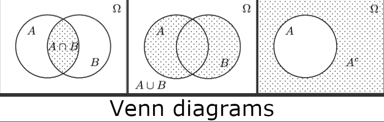
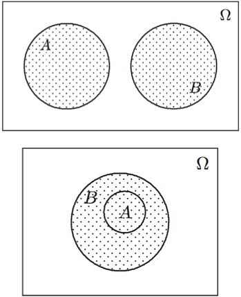

# Sample spaces and outcomes

## Sample space

The *sample space* for an experiment is a **set** where

- Each element of the sample space is an outcome of the experiment
- All possible outcomes are included in the set

The sample space is typically denoted by $\Omega$.

!!! example "Examples"
    Consider the experiment a subject is asked, which month their birthday falls in.
    Then the sample space is

    $$
    \Omega = \left\{ \text{Jan, Feb, Mar, Apr, May, Jun, Jul, Aug, Sep, Oct, Nov, Dec} \right\}
    $$

    Consider the experiment where a subject is asked their height.  
    Then the sample space is $\Omega = \R^+$

### Events

A subset of the sample space is called an ***event***.

- An event $A$ *occurs* if the outcome of the experiment is an element of $A$

!!! example ""
    In the birthday experiment, we can consider the months starting with the letter "J".  
    That is the event

    $$
    A = \left\{ \text{Jan, Jun, Jul} \right\}
    $$

## Set theory

Two events can be combined using *set operations*

- The *intersection* of $A$ and $B$ occurs if both $A$ and $B$ occur  
  $A \cap B = \left\{ w \in \Omega \;\vert\; w \in A \land w \in B \right\}$
- The *union* of $A$ and $B$ occurs if at least one of $A$ and $B$ occur  
  $A \cup B = \left\{ w \in \Omega \;\vert\; w \in A \lor w \in B \right\}$
- The *complement* of $A$ occurs if and only if $A$ does not occur  
  $A^C = \left\{ w \in \Omega \;\vert\; w \not\in A \right\}$

Events $A$ and $B$ are *disjoint* if $A$ and $B$ have no outcomes in common

$$
A \cup B = \empty
$$

Event $A$ *implies* event $B$ if the outcomes of $A$ lie in $B$

$$
A \subseteq B
$$

#### DeMorgan's law

$$
(A \cup B)^C = A^C \cap B^C \quad \text{and} \quad (A \cap B)^C = A^C \cup B^C
$$

### Probability of a union

$$
\begin{equation}
  P(A \cup B) = P(A) + P(B) - P(A \cap B)
\end{equation}
$$

??? note "Proof"
    We can write $A$ as a disjoint union

    $$
    A = A \cap \Omega = A \cap (B \cup B^C) \stackrel{\text{dist.}}{=} (A \cap B) \cup (A \cap B^C)
    $$
    
    Since the two sets are disjoint we have

    $$
    \tag{2} P(A) = P(A \cap B) + P(A \cap B^C)
    $$

    Similarly we can write

    $$
    A \cup B = (A \cup B) \cap (B \cup B^C) \stackrel{\text{dist.}}{=} \overbrace{((A \cup B) \cap B)}^{B} \cup \overbrace{((A \cup B) \cap B^C)}^{A \cup B^C}
    $$

    Since $B$ and $A \cap B^C$ are disjoint, we have
    
    $$
    \tag{3} P(A \cap B) = P(B) + P(A \cap B^C)
    $$
    
    Combining (2) and (3) by eliminating $P(A \cap B^C)$ gives us (1).

### Product of sample spaces

If we consider two experiments with the same sample spaces $\Omega_1$ and $\Omega_2$ then the
*combined experiment* has the sample space

$$
\begin{align*}
  \Omega = \Omega_1 \times \Omega_2 &= \left\{ (w_1, w_2) \;|\; w_1 \in \Omega_1,\; w_2 \in \Omega_2 \right\} \\
  \Omega &= \Omega_1 \times \Omega_2 \times \dots \times \Omega_n
\end{align*}
$$

where each $\Omega_i$ is a copy of the original sample space for an experiment performed $n$ times.
