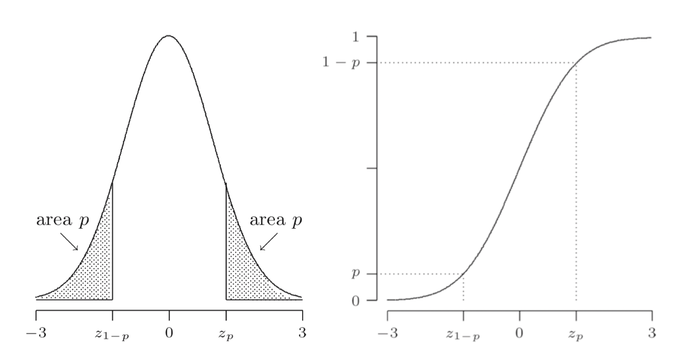

## Confidence intervals

Suppose a dataset $x_1, \ldots, x_n$ is given, modelled as a realization of random
variables $X_1, \ldots, X_n$. Let $\theta$ be the parameter of interest, and
$\gamma$ a number between 0 and 1. If there exist sample statistics
$L_n = g(X_1, \ldots, X_n)$ and $U_n = h(X_1, \ldots, X_n)$ such that

$$
\P(L_n < \theta < U_n) = \gamma
$$

for every value of $\theta$, then

$$
(l_n, u_n),
$$

where $l_n = g(x_1, \ldots, x_n)$ and $u_n = h(x_1, \ldots, x_n)$, is called
a 100$\gamma$% *confidence interval* for $\theta$.  
The number $\gamma$ is called the confidence interval.

If we can only find $L_n$ and $U_n$ satisfying

$$
\P(L_n < \theta < U_m) \geq \gamma
$$

We say $(l_n, u_n)$ is a conservative 100$\gamma$% confidence interval.
The actual confidence level may be higher.

Many confidence intervals are of the form

$$
(t - c \cdot \sigma_T, t + c \cdot \sigma_T)
$$

where $c$ is a number near 2 or 3.

### Normally distributed data

#### Critical values

The *critical value* $z_p$ of an $N(0,1)$ distribution is the number that
has right tail probability $p$, defined by

$$
\P(Z \geq z_p) = p,
$$

where $Z$ is an $N(0,1)$ random variable.  
$z_p$ is the $(1-p)$th quantile of the standard normal distribution

$$
\Phi (z_p) = \P(Z \leq z_p) = 1-p
$$

By the symmetry of the normal density, $\P(Z \leq -z_p) = \P(Z geq z_p) = p$,
so $\P(Z \geq -z_p) = 1- p$ and therefore

$$
z_{1-p} = -z_p
$$

For example, $z_{0.975} = -z_{0.025} = -1.96$

<figure>
<p align="center">
    
</p>
<figcaption align="center">Critical values of the standard normal distribution</figcaption>
</figure>

#### Variance known

If $\Xn$ is a random sample from an $N(\mu, \sigma^2)$ distribution, then
$\mean{X}_n$ is an $N(\mu, \sigma^2/n)$ distribution, and form the properties
of the normal distribution, we know that

$$
\frac{\mean{X}_n - \mu}{\sigma/\sqrt{n}} \text{ has an } N(0,1) \text{distribution}
$$

$$
\begin{align*}
    \gamma &= \P(c_l < \frac{\mean{X}_n - \mu}{\sigma/\sqrt{n}} < c_u) \\
    &= \P(c_l \frac{\sigma}{\sqrt{n}} < \mean{X}_n - \mu < c_u \frac{\sigma}{\sqrt{n}}) \\
    &= \P(\mean{X}_n - c_u \frac{\sigma}{\sqrt{n}} < \mu < \mean{X}_n - c_l \frac{\sigma}{\sqrt{n}})
\end{align*}
$$

We have found that

$$
L_n = \mean{X}_n - c_u \frac{\sigma}{\sqrt{n}} \quad \text{ and } \quad U_n = \mean{X}_n - c_l \frac{\sigma}{\sqrt{n}}
$$

satisfy the confidence interval definition: the interval $(L_n, U_n)$ covers $\mu$ with
probability $\gamma$. Therefore

$$
\left( \mean{x} - c_u \frac{\sigma}{\sqrt{n}}, \mean{x}_n - c_l \frac{\sigma}{\sqrt{n}} \right)
$$

is a 100$\gamma$% confidence interval for $\mu$.

???+ note "100$(1-\alpha)$% confidence interval"
    A common choice is to divide $\alpha = 1 - \gamma$ evenly between the tails, that
    is, solve $c_l$ and $c_u$ from

    $$
    \P(Z \geq c_u) = \alpha / 2 \quad \text{ and } \quad \P(Z \leq c_l) = \alpha / 2,
    $$

    so that $c_u = z_{\alpha/2}$ and $z_{1-\alpha/2}$.  
    The 100$(1 - \alpha)$% confidence interval for $\mu$ is

    $$
    \left( \mean{x}_n - z_{\alpha/2} \frac{\sigma}{\sqrt{n}}, \mean{x}_n + z_{\alpha/2} \frac{\sigma}{\sqrt{n}} \right)
    $$

    For example, if $\alpha = 0.05$, we use $z_{0.025} = 1.96$ and the 95% confidence
    interval is

    $$
    \left( \mean{x}_n - 1.96 \frac{\sigma}{\sqrt{n}}, \mean{x}_n + 1.96 \frac{\sigma}{\sqrt{n}} \right)
    $$

    In this case, even division of $\alpha$ between the tails is chosen due to
    it leading to the shortest confidence interval.

#### Variance unknown

When the variance is unknown, we can substitute the estimator $S_n$ for $\sigma$,
and the resulting random variable

$$
\frac{\mean{x}_n - \mu}{S_n/\sqrt{n}}
$$

has a distribution that only depends on $n$ and *not* on $\mu$ or $\sigma$.  
This random variable has a *$t$-distribution* [[Types of distributions]]

!!! note ""
    For a random sample $\Xn$ from an $N(\mu, \sigma^2)$ distribution, the
    *studentized mean*

    $$
    \frac{\mean{x}_n - \mu}{S_n / \sqrt{n}}
    $$

    has a $t(n-1)$ distribution, regardless of the values of $\mu$ and $\sigma$.  

From this fact and using critical values of the $t$-distribution, we derive that

$$
\begin{align*}
\P\left( -t_{n-1, \alpha/2} < \frac{\mean{X}_n - \mu}{S_n / \sqrt{n}} < t_{n-1, \alpha/2} \right) = 1 - \alpha,
\end{align*}
$$

and it now follows that a 100$(1-\alpha)$% confidence interval for $\mu$ is given by

$$
\left( \mean{x}_n - t_{n-1, \alpha/2} \frac{s_n}{\sqrt{n}}, \mean{x}_n + t_{n-1, \alpha/2} \frac{s_n}{\sqrt{n}} \right)
$$

#### Bootstrap confidence intervals

If we doubt the normality of the data and we do *not* have a large sample, usually
the best thing to do is to bootstrap.

!!! note "Empirical Bootstrap Simulation for the Studentized Mean"
    Given a dataset $\xn$, determine its empirical distribution function $F_n$ as 
    an estimate of $F$. The expectation corresponding to $F_n$ is $\mu^* = \mean{x}_n$.

    1. Generate a bootstrap dataset $x_1^*, x_2^*, \ldots, x_n^*$ from $F_n$
    2. Compute the studentized mean for the bootstrap dataset:
       ```math
       t^* = \frac{\mean{x}_n^* - \mean{x}_n}{s_n^* / \sqrt{n}}
       ```
       where $\mean{x}_n^*$ and $s_n^*$ are the sample mean and sample standard deviation
       of $x_1^*, x_2^*, \ldots, x_n^*$
    Repeat steps 1 and 2 many times.
    
From the bootstrap experiment we can determine $c_l^*$ and $c_u^*$ such that

$$
\P\left( c_l^* < \frac{\mean{X}_n^* - \mu^*}{S_n^* / \sqrt{n}} < c_u^* \right) \approx 1 - \alpha
$$

We can use these estimated critical values as bootstrap approximations to $c_l$
and $c_u$:

$$
c_l \approx c^l^* \quad \text{ and } \quad c_u \approx c_u^*
$$

Therefore, we call

$$
\left( \mean{x}_n - c_u^* \frac{s_n}{\sqrt{n}}, \mean{x}_n - c_l^* \frac{s_n}{\sqrt{n}} \right)
$$

a 100$(1-\alpha)$% *bootstrap confidence interval for $\mu$*.

##### Why the bootstrap may be better

If the distribution is skewed, that is reflected in the bootstrap confidence interval.
Whereas the $t$-interval is centered around the sample mean.
In some sense, the bootstrap adapts to the shape of the distribution, and thus leads
to more accurate confidence statements than using the method for normal data.

#### Large samples

A variant of the CLT states

$$
\begin{align*}
\lim_{n \to \infty} \left( \frac{\mean{X}_n - \mu}{S_n / \sqrt{n}} \right) = \Phi(0,1)
\end{align*}
$$

This fact is the basis for *large sample confidence intervals*.  
If $n$ is large enough, we may use

$$
\begin{align*}
\P\left( -a_{\alpha/2} < \frac{\mean{X}_n - \mu}{S_n/\sqrt{n}} < z_{\alpha/2} \right) \approx 1 - \alpha
\end{align*}
$$

And then the we have that

$$
\left( \mean{x}_n - z_{\alpha/2} \frac{s_n}{\sqrt{n}}, \mean{x}_n + z_{\alpha/2} \frac{s_n}{\sqrt{n}} \right)
$$

is an approximate 100$(1-\alpha)$% confidence interval for $\mu$.
