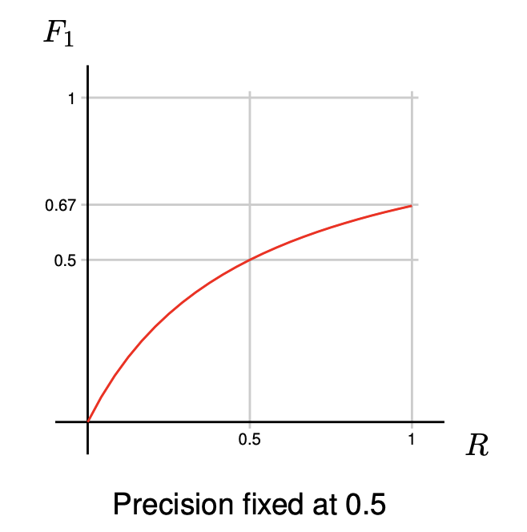

# Evaluating Classifiers

## Accuracy

Proportion of elements classified correctly

$$
\begin{aligned}
\text{Accuracy} = \frac{\text{sum of diagonal}}{\text{total sum}}
\end{aligned}
$$

- Simples method for classification
- Can be misleading in unbalanced datasets!
- Provides no information about individual classes

## Precision and Recall

- Class-specific metrics
    - Based on single rows/columns of the confusion matrix
- Common metrics in NLP come from *information retrieval*
- In a database search, we want to find
    - All relevant results
    - No distracting irrelevant results

### Precision

Out of the examples we *predicted to be* in a certain class, how many of them
are correct?  
(*how many irrelevant results did we find?*)

$$
\begin{aligned}
\text{Precision} = \frac{\text{single diagonal element}}{\text{sum of single column}}
\end{aligned}
$$

### Recall

Out of the examples *that actually belong* to a certain class, how many of them
did we find?  
(*Did we actually find what we were looking for?*)

$$
\begin{aligned}
\text{Recall} = \frac{\text{single diagonal element}}{\text{sum of single row}}
\end{aligned}
$$

### Precision/Recall vs. Sensitivity/Specificity

- Precision and Recall focus on the true positives in the context of *what was
  found* and *what should have been found*
- Sensitivity and Specificity focus on *correct identification of positives
  and negatives*
- Sensitivity is just another name for Recall, but *Specificity and Precision
  are different.*
- Se and Sp are like "positive and negative Recall"

$$
\begin{aligned}
    \text{P} = \frac{\text{TP}}{\text{TP} + \text{FP}} \qquad
    \text{R} = \text{Se} = \frac{\text{TP}}{\text{TP} + \text{FN}} \qquad
    \text{Sp} = \frac{\text{TN}}{\text{TN} + \text{FP}}
\end{aligned}
$$

Precision and Recall can be gamed!

*100% Precision* (good chance)

- Return only the one example you're most certain of

*100% Recall*

- Return the entire dataset

*But you can't game both of them at the same time*

## F-score (or F-measure)

- Summarizes Precision and Recall in a single measure
- **F-score** (or $F_1$) is the *harmonic mean* of Precision and Recall

$$
F = 2 \cdot \frac{P \cdot R}{P + R}
$$

- If P and R are equal, then F is the same
- If they are difference, then F is the *lower* of them
- By maximizing F-score, we emphasize balanced P and R
- F-score can be generalized with a parameter to control the balance

### F-score behaviour

### Micro-averaging

- Precision and Recall are per class, but sometimes we'd like to have
  *one single number* to characterize our performance.
- *Micro-averaged Precision, Recall and F-score*:
    - Add the counts of all classes, then compute P, R and F-score
- If each example has only one label, this is *the same as accuracy*

### Macro-averaging

- *Macro-averaged Precision, Recall and F-score*:
    - Compute P, R and F-score for each class, then take the arithmetic mean
    
$$
P_{\text{macro}} = \frac{1}{|K|}\sum_{k \in K} P_k \qquad
R_{\text{macro}} = \frac{1}{|K|}\sum_{k \in K} R_k
$$

- Macro-averaging is sensitive to outlier classes!  
  (can enforce balance, but this also causes problems)
- **Macro-averaged Recall** is least sensitive to imbalance
  