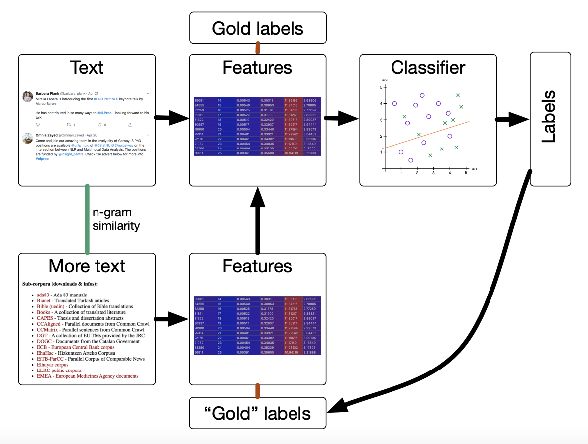

# N-Gram Language Modelling

!!! note ""
    Learns a probability distribution over a sequence of words

    $$
    p(w_1, w_2, \ldots, w_N)
    $$

Allows you to predict word sequences that are ungrammatical, but still occur
often. Early language models only worked well on sentences with proper grammar,
and wouldn't work with social media texts at all.

Models joint probability of the word sequence rather than conditional probability.
Lets you sample from the model and generate plausible sounding word sequences.

Often used as components in other models:

- Automatic speech recognition: Acoustic model + language model
- Statistical machine translation: Translation model + language model

Looking at long-range dependencies gives too many parameters to model.
It is more reasonable to look at *local* dependencies.

- *the* strongly flavors a following noun (or adjective)
- After a full stop, we are likely to see a capital letter

## Markov assumption

!!! note ""
    Each element of the sequence depends only on the immediately preceding element
    and is *independent* of the previous history.

    $$
    p(w_i \given w_1, \ldots, w_{i-1}) \approx p(w_i \given w_{i-1})
    $$

!!! note "$k$-th order Markov assumption"
    Each element of the sequence depends only on the *k* immediately preceding
    elements.

    $$
    p(w_i \given w_1, \ldots, w_{i-1}) \approx p(w_i \given w_{i-k}, \ldots, w_{i-1})
    $$
    
For a model without independence assumption:

- We need to estimate $p(w_N \given w_1, w_2, \ldots, w_{N-1})$
- Up to $V^N$ model parameters

For a $k$-th order Markov model:

- We need to estimate $p(w_{k+1} \given w_1, \ldots, w_k)$
- Up to $V^{k+1}$ model parameters

In a realistic language model:

- $V \approx 10^4$ to $10^5$
- $n \approx 30$ to $80$
- $k \approx 2$ to $5$

## Sequence padding

Add special symbols to mark the start and end of each sentence.
Makes the model learn good start/end of sentences.

Use for example `<s>` and `</s>` or `BOS` and `EOS`.

## N-Gram language model

Markov models for language modelling.

N-Gram: sequence of $n$ tokens in a text.

1-gram = Unigram; 2-gram = Bigram; 3-gram = Trigram

A 4-gram model is a 3rd order Markov model.

!!! example "Example"
    $$
    \underbrace{\stackrel{1}{\text{in}}\quad\stackrel{2}{\text{the}}}_{\stackrel{\text{bigram}}{\text{2-gram}}}
    \qquad p(\text{the} \given \underbrace{\phantom{text}\text{in}\phantom{text}}_{\text{firstorder MM}})
    $$

N-gram models estimate *probabilities*. With one small factor per token in the sentence,
numbers become *really* small very quickly. Bad numerical precision, risk of scores
getting rounded to 0.

Use *log-probabilities* instead:

- Much better numerical stability
- Multiplication becomes addition
- Do this *whenever* you use probabilities!

### Perplexity

!!! note ""
    Commonly used to compare language models:

    $$
    PPL = p(w_1, w_2, \ldots, w_N)^{-\frac{1}{N}}
    $$

    Indication of how "confused" the language model is:  
    How many continuations does it consider plausible on average per step?
    
    **Lower** perplexity is better!  
    Only comparable if they refer to the ***same vocabulary***
    
1 is the lowest possible perplexity, where the model knows exactly what it is
going to do after every step.

Typical for language models is $\approx100$ PPL.

### Notation

- \#tokens(w~1~, w~2~): Probability of n-gram w~1~w~2~
- \#tokens(w~1~, $\bullet$): Probability of n-gram starting with w~1~
- \#types(w~1~, $\bullet$): Amount of different of n-grams starting with w~1~

### Maximum likelihood estimation

$$
p(w_3 \given w_1, w_2) = \frac{\text{\#tokens}(w_1w_2w_3)}{\text{\#tokens}(w_1w_2\bullet)}
$$

`<s>` Star light , ==star bright== , first ==star I== see tonight ! `</s>`

$$
\begin{align*}
p(\text{bright} \given \text{star}) = \frac{\text{\#tokens(star bright)}}{\text{\#tokens}(\text{star }\bullet)}
= \frac{1}{2} = 0.5
\end{align*}
$$

#### Problems with maximum likelihood estimation

- Underestimates n-grams that have not been seen. Estimates them with a probability 0.
- Overestimates n-grams that have been seen only a few times.
- We get good estimates of very frequent tokens, but per Zipf's law,
  *most tokens are __not__ frequent*

### Smoothing

!!! note "Add-one estimate (Laplace smoothing)"
    Add one to each count to avoid zero counts.
    
    $$
    \begin{align*}
    p(w_3 \given w_1, w_2) &= \frac{\text{\#tokens}(w_1w_2w_3)+1}{\sum_{w\in V}\left(\#\text{tokens}(w_1w_2w) + 1\right)}
    &= \frac{\text{\#tokens}(w_1w_2w_3) + 1}{\text{\#tokens}(w_1w_2\bullet) + \abs{V}}
    \end{align*}
    $$

    Advantage: Really simple, gets rid of 0 probabilities.  
    Issue: Significantly overestimates unseen events.

#### General principle

- Take away probability mass from the n-grams we have seen by *discounting*
  their estimates.
- Assign this probability mass to n-grams we have not seen.
- The total probability still sums to 1 *for each context*

#### (improved) Kneser-Ney smoothing

- Contexts we don't know correspond to *backoff situations*
- Uses different distributions for *higher-order* and *backoff* distributions

- One of the best-performing smoothing models for natural language
- Based on absolute discounting with clever backoff distribution
- For sequences with few infrequent tokens, estimation may fail!

#### Witten-Bell smoothing

- Good method for sequences that don't meet Kneser-Key smoothing.
- Uses the number of different continuations of an n-gram to estimate
  how likely yet another new continuation will be

## Data Augmentation and Self-Training

- Add more data to the training set to make the classifier perform well more broadly
- Enforce desired model symmetries to reduce overfitting
    - In computer vision: Translational or rotational invariance
    - In NLP: Upper-/lowercasing, punctiation normalization
    - Can be more easily addressed in pre-processing
- More relevant: **Increase coverage of vocabulary and contexts**

## N-gram models for data selection

- N-gram models can measure closeness to a "model" text type
- We can find examples that are similar to the training corpus by extracting
  the items with the lowest perplexity under a model trained on your reference corpus
- How to get annotations?
    - Manual annotation: Reliable but time-consuming
    - Self-training: Use classifier to get annotations
